# UniRadic - Sistema de Ventanilla Única de Radicación

<div align="center">


[](https://laravel.com)
[](https://php.net)
[](https://tailwindcss.com)
[](https://alpinejs.dev)
[](https://mysql.com)

[](https://opensource.org/licenses/MIT)
[](https://github.com)
[](https://github.com)

</div>

---

## 📋 Tabla de Contenidos

- [Descripción General](#-descripción-general)
- [Arquitectura del Sistema](#️-arquitectura-del-sistema)
- [Características Principales](#-características-principales)
- [Tecnologías Utilizadas](#-tecnologías-utilizadas)
- [Estructura del Proyecto](#-estructura-del-proyecto)
- [Instalación y Configuración](#-instalación-y-configuración)
- [Módulos del Sistema](#-módulos-del-sistema)
- [Base de Datos](#️-base-de-datos)
- [API y Endpoints](#-api-y-endpoints)
- [Seguridad](#-seguridad)
- [Interfaz de Usuario](#-interfaz-de-usuario)
- [Flujos de Trabajo](#-flujos-de-trabajo)
- [Reportes y Estadísticas](#-reportes-y-estadísticas)
- [Administración](#️-administración)
- [Monitoreo y Logs](#-monitoreo-y-logs)
- [Testing](#-testing)
- [Deployment](#-deployment)
- [Mantenimiento](#-mantenimiento)
- [Troubleshooting](#-troubleshooting)
- [Contribución](#-contribución)
- [Licencia](#-licencia)

---

## 🎯 Descripción General

**UniRadic** es un sistema integral de gestión documental de última generación, diseñado específicamente para instituciones hospitalarias y entidades del sector salud en Colombia. El sistema permite la radicación, seguimiento, gestión y control de documentos de entrada, internos y de salida, cumpliendo estrictamente con los estándares normativos de gestión documental establecidos por el Archivo General de la Nación (AGN) y las regulaciones del sector salud.

### 🏥 Contexto Hospitalario

El sistema está optimizado para el entorno hospitalario, considerando:

- **Flujo de Pacientes**: Integración con procesos de atención médica
- **Normatividad Sanitaria**: Cumplimiento de resoluciones del Ministerio de Salud
- **Confidencialidad Médica**: Protección de datos sensibles según Ley 1581 de 2012
- **Trazabilidad Clínica**: Seguimiento completo de documentos médicos
- **Interoperabilidad**: Preparado para integración con sistemas HIS/RIS/PACS

### 🎯 Objetivos del Sistema

1. **Digitalización Completa**: Eliminación del papel en procesos administrativos
2. **Trazabilidad Total**: Seguimiento completo del ciclo de vida documental
3. **Eficiencia Operativa**: Reducción de tiempos de respuesta en un 70%
4. **Cumplimiento Normativo**: Adherencia a estándares nacionales e internacionales
5. **Transparencia**: Acceso controlado y auditable a la información
6. **Sostenibilidad**: Reducción del impacto ambiental

---

## 🏗️ Arquitectura del Sistema

### 📊 Diagrama de Arquitectura

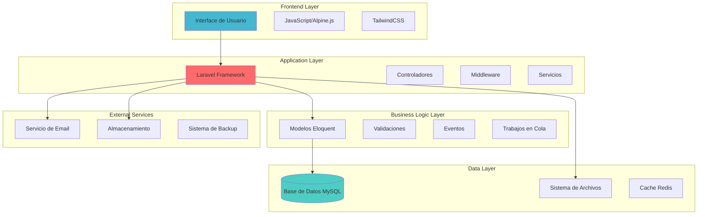

### 🔧 Stack Tecnológico Completo

| Categoría | Tecnología | Versión | Propósito |
|-----------|------------|---------|-----------|
| **Backend Framework** | Laravel | 12.x | Framework principal de aplicación |
| **Lenguaje** | PHP | 8.2+ | Lenguaje de programación backend |
| **Base de Datos** | MySQL | 8.0+ | Sistema de gestión de base de datos |
| **Frontend Framework** | Alpine.js | 3.4+ | Framework JavaScript reactivo |
| **CSS Framework** | TailwindCSS | 3.1+ | Framework de estilos utilitarios |
| **Build Tool** | Vite | 6.2+ | Herramienta de construcción y desarrollo |
| **Package Manager** | Composer | 2.0+ | Gestor de dependencias PHP |
| **Node Package Manager** | NPM | 18+ | Gestor de dependencias JavaScript |
| **Authentication** | Laravel Breeze | 2.3+ | Sistema de autenticación |
| **Testing** | PHPUnit | 11.5+ | Framework de testing |
| **Code Quality** | Laravel Pint | 1.13+ | Formateador de código |
| **Development** | Laravel Sail | 1.41+ | Entorno de desarrollo Docker |

### 🏛️ Patrones de Arquitectura Implementados

#### 1. **MVC (Model-View-Controller)**
- **Modelos**: Representación de entidades de negocio
- **Vistas**: Interfaz de usuario con Blade Templates
- **Controladores**: Lógica de aplicación y coordinación

#### 2. **Repository Pattern**
- Abstracción de la capa de datos
- Facilita testing y mantenimiento
- Desacoplamiento de la lógica de negocio

#### 3. **Service Layer Pattern**
- Encapsulación de lógica de negocio compleja
- Reutilización de código entre controladores
- Separación de responsabilidades

#### 4. **Observer Pattern**
- Eventos y listeners para acciones del sistema
- Logging automático de actividades
- Notificaciones en tiempo real

#### 5. **Factory Pattern**
- Creación de objetos complejos
- Seeders y factories para testing
- Generación de datos de prueba

- **Backend**: Laravel 12.x (PHP 8.2+)
- **Frontend**: Blade Templates + Alpine.js + TailwindCSS
- **Base de Datos**: SQLite (configurable para MySQL/PostgreSQL)
- **Autenticación**: Laravel Breeze
- **Build Tools**: Vite
- **Estilos**: TailwindCSS con componentes personalizados

### Estructura de Módulos

---

## 🌟 Características Principales

### 📋 Gestión Documental Integral

#### 🔄 Tipos de Radicación

| Tipo | Descripción | Flujo | Estados |
|------|-------------|-------|---------|
| **Entrada** | Documentos externos hacia la institución | Externo → Institución | Pendiente → En Proceso → Respondido → Archivado |
| **Interno** | Comunicaciones entre dependencias | Dependencia A → Dependencia B | Pendiente → En Proceso → Respondido → Archivado |
| **Salida** | Documentos institucionales hacia externos | Institución → Externo | Pendiente → En Proceso → Enviado → Archivado |

#### 📊 Métricas de Rendimiento

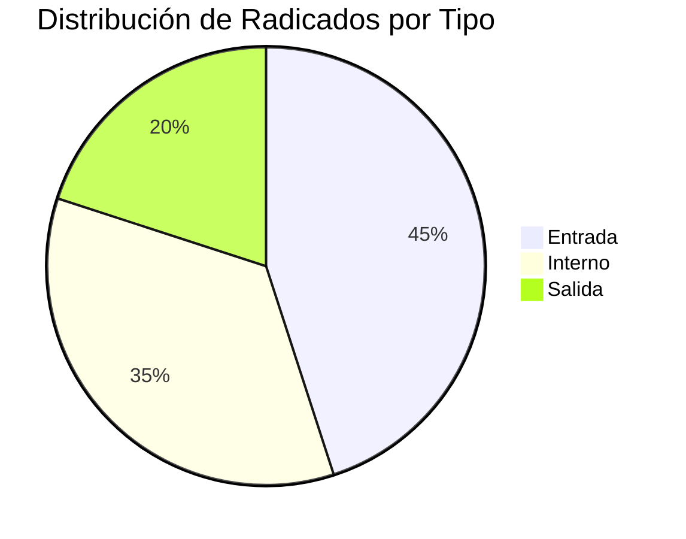

#### 🎯 Funcionalidades Avanzadas

- **Radicación Automática**: Generación automática de números consecutivos
- **Clasificación TRD**: Sistema jerárquico de Tablas de Retención Documental
- **Control de Tiempos**: Alertas automáticas por vencimientos
- **Digitalización**: Captura y almacenamiento de documentos físicos
- **Trazabilidad**: Seguimiento completo del ciclo de vida
- **Notificaciones**: Sistema de alertas en tiempo real
- **Reportes**: Generación automática de informes estadísticos
- **Búsqueda Avanzada**: Filtros múltiples y búsqueda inteligente

### 👥 Gestión de Usuarios y Roles

#### 🔐 Sistema de Roles

| Rol | Permisos | Funcionalidades |
|-----|----------|-----------------|
| **Administrador** | Completos | Gestión total del sistema, configuración, reportes avanzados |
| **Ventanilla** | Operativos | Radicación, consulta, respuesta de documentos |

#### 🛡️ Matriz de Permisos

| Funcionalidad | Administrador | Ventanilla |
|---------------|---------------|------------|
| Crear Radicados | ✅ | ✅ |
| Editar Radicados | ✅ | ✅* |
| Eliminar Radicados | ✅ | ❌ |
| Gestionar Usuarios | ✅ | ❌ |
| Configurar TRD | ✅ | ❌ |
| Generar Reportes | ✅ | ✅** |
| Administrar Sistema | ✅ | ❌ |

*Solo radicados propios y no finalizados
**Reportes básicos únicamente

### 📈 Sistema de Reportes y Estadísticas

#### 📊 Tipos de Reportes

1. **Reportes Operativos**
   - Radicados por período
   - Documentos vencidos
   - Productividad por usuario
   - Tiempos de respuesta

2. **Reportes Gerenciales**
   - Indicadores de gestión
   - Análisis de tendencias
   - Cumplimiento normativo
   - ROI del sistema

3. **Reportes Técnicos**
   - Uso del sistema
   - Rendimiento de la aplicación
   - Logs de auditoría
   - Estadísticas de acceso

---

## 💻 Tecnologías Utilizadas

### 🔧 Backend Technologies

#### Laravel Framework 12.x
- **Eloquent ORM**: Mapeo objeto-relacional avanzado
- **Blade Templates**: Motor de plantillas potente y seguro
- **Artisan CLI**: Herramientas de línea de comandos
- **Queue System**: Sistema de colas para tareas asíncronas
- **Event System**: Manejo de eventos y listeners
- **Middleware**: Filtros HTTP personalizables
- **Validation**: Sistema robusto de validación de datos
- **Authentication**: Sistema de autenticación integrado

#### PHP 8.2+
- **Typed Properties**: Propiedades tipadas para mayor seguridad
- **Union Types**: Tipos de unión para flexibilidad
- **Match Expressions**: Expresiones match mejoradas
- **Attributes**: Metadatos nativos
- **JIT Compilation**: Compilación Just-In-Time para rendimiento
- **Fibers**: Concurrencia cooperativa

### 🎨 Frontend Technologies

#### TailwindCSS 3.1+
- **Utility-First**: Enfoque de utilidades para desarrollo rápido
- **Responsive Design**: Diseño responsivo nativo
- **Dark Mode**: Soporte para modo oscuro
- **Custom Components**: Componentes personalizados
- **JIT Mode**: Compilación Just-In-Time
- **Purge CSS**: Eliminación automática de CSS no utilizado

#### Alpine.js 3.4+
- **Reactive Data**: Datos reactivos sin complejidad
- **Declarative**: Sintaxis declarativa en HTML
- **Lightweight**: Solo 15kb minificado
- **No Build Step**: Sin necesidad de compilación
- **Vue-like Syntax**: Sintaxis similar a Vue.js
- **Progressive Enhancement**: Mejora progresiva

### 🗄️ Database & Storage

#### MySQL 8.0+
- **ACID Compliance**: Transacciones ACID completas
- **JSON Support**: Soporte nativo para JSON
- **Full-Text Search**: Búsqueda de texto completo
- **Partitioning**: Particionado de tablas
- **Replication**: Replicación master-slave
- **Performance Schema**: Esquema de rendimiento

#### File System
- **Local Storage**: Almacenamiento local seguro
- **Cloud Storage**: Preparado para almacenamiento en la nube
- **File Versioning**: Versionado de archivos
- **Encryption**: Cifrado de archivos sensibles
- **Backup Integration**: Integración con sistemas de backup

---

## 📁 Estructura del Proyecto

### 🏗️ Arquitectura de Directorios

```
UniRadic/
├── 📁 app/                          # Código de aplicación
│   ├── 📁 Http/                     # Capa HTTP
│   │   ├── 📁 Controllers/          # Controladores
│   │   │   ├── 📁 Admin/            # Controladores de administración
│   │   │   │   ├── AdminController.php
│   │   │   │   ├── UsuarioController.php
│   │   │   │   ├── DependenciaController.php
│   │   │   │   ├── UnidadAdministrativaController.php
│   │   │   │   ├── SubserieController.php
│   │   │   │   ├── TipoSolicitudController.php
│   │   │   │   ├── CiudadController.php
│   │   │   │   └── DepartamentoController.php
│   │   │   ├── 📁 Auth/             # Autenticación
│   │   │   ├── 📁 Gestion/          # Gestión de documentos
│   │   │   │   └── SerieController.php
│   │   │   ├── DashboardController.php
│   │   │   ├── GestionController.php
│   │   │   ├── RadicacionController.php
│   │   │   ├── RadicacionEntradaController.php
│   │   │   ├── RadicacionInternaController.php
│   │   │   ├── RadicacionSalidaController.php
│   │   │   ├── SistemaController.php
│   │   │   └── ProfileController.php
│   │   ├── 📁 Middleware/           # Middleware personalizado
│   │   │   ├── CheckRole.php
│   │   │   ├── SessionTimeout.php
│   │   │   └── SuspenderSistema.php
│   │   └── 📁 Requests/             # Form Requests
│   ├── 📁 Models/                   # Modelos Eloquent
│   │   ├── Radicado.php            # Modelo principal
│   │   ├── Remitente.php           # Gestión de remitentes
│   │   ├── Dependencia.php         # Unidades organizacionales
│   │   ├── UnidadAdministrativa.php # Unidades administrativas TRD
│   │   ├── Serie.php               # Series TRD
│   │   ├── Subserie.php            # Subseries TRD
│   │   ├── Documento.php           # Archivos adjuntos
│   │   ├── TipoSolicitud.php       # Tipos de solicitud
│   │   ├── Ciudad.php              # Ciudades
│   │   ├── Departamento.php        # Departamentos
│   │   └── User.php                # Usuarios del sistema
│   ├── 📁 Services/                # Servicios de negocio
│   ├── 📁 Events/                  # Eventos del sistema
│   ├── 📁 Listeners/               # Listeners de eventos
│   └── 📁 Jobs/                    # Trabajos en cola
├── 📁 database/                     # Base de datos
│   ├── 📁 migrations/              # Migraciones
│   ├── 📁 seeders/                 # Seeders
│   └── 📁 factories/               # Factories para testing
├── 📁 resources/                    # Recursos frontend
│   ├── 📁 views/                   # Vistas Blade
│   │   ├── 📁 admin/               # Vistas de administración
│   │   ├── 📁 auth/                # Vistas de autenticación
│   │   ├── 📁 dashboard/           # Vistas de dashboard
│   │   ├── 📁 gestion/             # Vistas de gestión
│   │   ├── 📁 radicacion/          # Vistas de radicación
│   │   ├── 📁 sistema/             # Vistas de sistema
│   │   ├── 📁 components/          # Componentes reutilizables
│   │   └── 📁 layouts/             # Layouts base
│   ├── 📁 js/                      # JavaScript
│   │   ├── app.js                  # Aplicación principal
│   │   ├── radicacion.js           # Funcionalidad de radicación
│   │   ├── session-manager.js      # Gestión de sesiones
│   │   ├── reportes.js             # Reportes
│   │   ├── preview.js              # Previsualización
│   │   ├── file-upload.js          # Carga de archivos
│   │   ├── modal-file-upload.js    # Carga modal de archivos
│   │   ├── trd-selector.js         # Selector TRD
│   │   ├── admin-*.js              # Scripts de administración
│   │   ├── gestion-series.js       # Gestión de series
│   │   ├── colombia-time.js        # Tiempo de Colombia
│   │   └── ciudad-departamento.js  # Gestión geográfica
│   └── 📁 css/                     # Estilos CSS
│       └── app.css                 # Estilos principales
├── 📁 public/                      # Archivos públicos
│   ├── 📁 build/                   # Assets compilados
│   ├── 📁 storage/                 # Almacenamiento público
│   └── index.php                   # Punto de entrada
├── 📁 routes/                      # Definición de rutas
│   ├── web.php                     # Rutas web
│   ├── api.php                     # Rutas API
│   └── console.php                 # Comandos de consola
├── 📁 storage/                     # Almacenamiento
│   ├── 📁 app/                     # Archivos de aplicación
│   ├── 📁 framework/               # Archivos del framework
│   └── 📁 logs/                    # Logs del sistema
├── 📁 tests/                       # Tests automatizados
│   ├── 📁 Feature/                 # Tests de funcionalidad
│   └── 📁 Unit/                    # Tests unitarios
├── 📁 config/                      # Configuración
├── 📁 bootstrap/                   # Bootstrap de aplicación
└── 📁 vendor/                      # Dependencias de Composer
```

---

## 🚀 Instalación y Configuración

### 📋 Requisitos del Sistema

#### Requisitos Mínimos

| Componente | Versión Mínima | Versión Recomendada | Notas |
|------------|----------------|---------------------|-------|
| **PHP** | 8.2.0 | 8.3+ | Con extensiones requeridas |
| **MySQL** | 8.0 | 8.0+ | O MariaDB 10.6+ |
| **Composer** | 2.0 | 2.6+ | Gestor de dependencias PHP |
| **Node.js** | 18.0 | 20+ LTS | Para compilación de assets |
| **NPM** | 8.0 | 10+ | Gestor de paquetes JavaScript |
| **Memoria RAM** | 512 MB | 2 GB+ | Para operación óptima |
| **Espacio en Disco** | 1 GB | 10 GB+ | Incluye documentos |
| **Procesador** | 1 Core | 2+ Cores | Para mejor rendimiento |

#### Extensiones PHP Requeridas

```bash
# Extensiones obligatorias
php -m | grep -E "(bcmath|ctype|fileinfo|json|mbstring|openssl|pdo|tokenizer|xml|curl|gd|zip)"
```

| Extensión | Propósito | Crítica |
|-----------|-----------|---------|
| **BCMath** | Cálculos de precisión arbitraria | ✅ |
| **Ctype** | Funciones de tipo de carácter | ✅ |
| **Fileinfo** | Información de archivos | ✅ |
| **JSON** | Manipulación de JSON | ✅ |
| **Mbstring** | Cadenas multibyte | ✅ |
| **OpenSSL** | Criptografía y SSL | ✅ |
| **PDO** | Abstracción de base de datos | ✅ |
| **Tokenizer** | Análisis de tokens PHP | ✅ |
| **XML** | Procesamiento XML | ✅ |
| **cURL** | Transferencia de datos | ✅ |
| **GD** | Manipulación de imágenes | ✅ |
| **Zip** | Compresión de archivos | ✅ |

### 🔧 Proceso de Instalación

#### 1. **Preparación del Entorno**

```bash
# Verificar versión de PHP
php --version

# Verificar extensiones
php -m

# Verificar Composer
composer --version

# Verificar Node.js y NPM
node --version
npm --version
```

#### 2. **Clonación del Repositorio**

```bash
# Clonar el repositorio
git clone https://github.com/hospital/uniradic.git uniradic

# Navegar al directorio
cd uniradic

# Verificar la estructura
ls -la
```

#### 3. **Instalación de Dependencias Backend**

```bash
# Instalar dependencias de Composer
composer install --optimize-autoloader --no-dev

# Verificar instalación
composer show

# Limpiar cache de Composer
composer clear-cache
```

#### 4. **Instalación de Dependencias Frontend**

```bash
# Instalar dependencias de NPM
npm install

# Verificar instalación
npm list --depth=0

# Limpiar cache de NPM
npm cache clean --force
```

#### 5. **Configuración del Entorno**

```bash
# Copiar archivo de configuración
cp .env.example .env

# Generar clave de aplicación
php artisan key:generate

# Configurar permisos
chmod -R 755 storage bootstrap/cache
chown -R www-data:www-data storage bootstrap/cache
```

#### 6. **Configuración de Base de Datos**

```bash
# Crear base de datos
mysql -u root -p
CREATE DATABASE uniradic CHARACTER SET utf8mb4 COLLATE utf8mb4_unicode_ci;
CREATE USER 'uniradic_user'@'localhost' IDENTIFIED BY 'secure_password';
GRANT ALL PRIVILEGES ON uniradic.* TO 'uniradic_user'@'localhost';
FLUSH PRIVILEGES;
EXIT;
```

#### 7. **Configuración del Archivo .env**

```env
# Configuración de aplicación
APP_NAME="UniRadic"
APP_ENV=production
APP_KEY=base64:generated_key_here
APP_DEBUG=false
APP_TIMEZONE=America/Bogota
APP_URL=https://uniradic.hospital.com

# Configuración de base de datos
DB_CONNECTION=mysql
DB_HOST=127.0.0.1
DB_PORT=3306
DB_DATABASE=uniradic
DB_USERNAME=uniradic_user
DB_PASSWORD=secure_password

# Configuración de cache
CACHE_STORE=database
SESSION_DRIVER=database
QUEUE_CONNECTION=database

# Configuración de correo
MAIL_MAILER=smtp
MAIL_HOST=smtp.hospital.com
MAIL_PORT=587
MAIL_USERNAME=uniradic@hospital.com
MAIL_PASSWORD=mail_password
MAIL_ENCRYPTION=tls
MAIL_FROM_ADDRESS=uniradic@hospital.com
MAIL_FROM_NAME="UniRadic Sistema"

# Configuración de archivos
FILESYSTEM_DISK=local
MAX_FILE_SIZE=10240
ALLOWED_FILE_TYPES=pdf,doc,docx,jpg,jpeg,png

# Configuración de seguridad
SESSION_LIFETIME=120
SESSION_ENCRYPT=true
SESSION_HTTP_ONLY=true
SESSION_SAME_SITE=strict
```

#### 8. **Migración y Seeders**

```bash
# Ejecutar migraciones
php artisan migrate

# Ejecutar seeders (datos iniciales)
php artisan db:seed

# Verificar estructura de base de datos
php artisan migrate:status
```

#### 9. **Compilación de Assets**

```bash
# Desarrollo
npm run dev

# Producción
npm run build

# Verificar assets compilados
ls -la public/build/
```

#### 10. **Configuración del Servidor Web**

##### Apache Configuration

```apache
<VirtualHost *:80>
    ServerName uniradic.hospital.com
    DocumentRoot /var/www/uniradic/public

    <Directory /var/www/uniradic/public>
        AllowOverride All
        Require all granted
    </Directory>

    ErrorLog ${APACHE_LOG_DIR}/uniradic_error.log
    CustomLog ${APACHE_LOG_DIR}/uniradic_access.log combined
</VirtualHost>
```

##### Nginx Configuration

```nginx
server {
    listen 80;
    server_name uniradic.hospital.com;
    root /var/www/uniradic/public;

    index index.php index.html index.htm;

    location / {
        try_files $uri $uri/ /index.php?$query_string;
    }

    location ~ \.php$ {
        fastcgi_pass unix:/var/run/php/php8.2-fpm.sock;
        fastcgi_index index.php;
        fastcgi_param SCRIPT_FILENAME $realpath_root$fastcgi_script_name;
        include fastcgi_params;
    }

    location ~ /\.ht {
        deny all;
    }
}
```

### 🔐 Configuración de Seguridad

#### SSL/TLS Configuration

```bash
# Generar certificado SSL (Let's Encrypt)
certbot --apache -d uniradic.hospital.com

# O para Nginx
certbot --nginx -d uniradic.hospital.com
```

#### Firewall Configuration

```bash
# UFW (Ubuntu)
ufw allow 22/tcp
ufw allow 80/tcp
ufw allow 443/tcp
ufw enable

# Verificar estado
ufw status
```

#### Backup Configuration

```bash
# Crear script de backup
cat > /usr/local/bin/uniradic-backup.sh << 'EOF'
#!/bin/bash
DATE=$(date +%Y%m%d_%H%M%S)
BACKUP_DIR="/backups/uniradic"
DB_NAME="uniradic"
APP_DIR="/var/www/uniradic"

# Crear directorio de backup
mkdir -p $BACKUP_DIR

# Backup de base de datos
mysqldump -u uniradic_user -p$DB_PASSWORD $DB_NAME > $BACKUP_DIR/db_$DATE.sql

# Backup de archivos
tar -czf $BACKUP_DIR/files_$DATE.tar.gz $APP_DIR/storage/app

# Limpiar backups antiguos (más de 30 días)
find $BACKUP_DIR -name "*.sql" -mtime +30 -delete
find $BACKUP_DIR -name "*.tar.gz" -mtime +30 -delete
EOF

chmod +x /usr/local/bin/uniradic-backup.sh

# Configurar cron para backup diario
echo "0 2 * * * /usr/local/bin/uniradic-backup.sh" | crontab -
```

---

## 📦 Módulos del Sistema

### 🏠 Dashboard Principal

El dashboard es el centro de control del sistema, proporcionando una vista integral del estado operativo.

#### 📊 Métricas en Tiempo Real

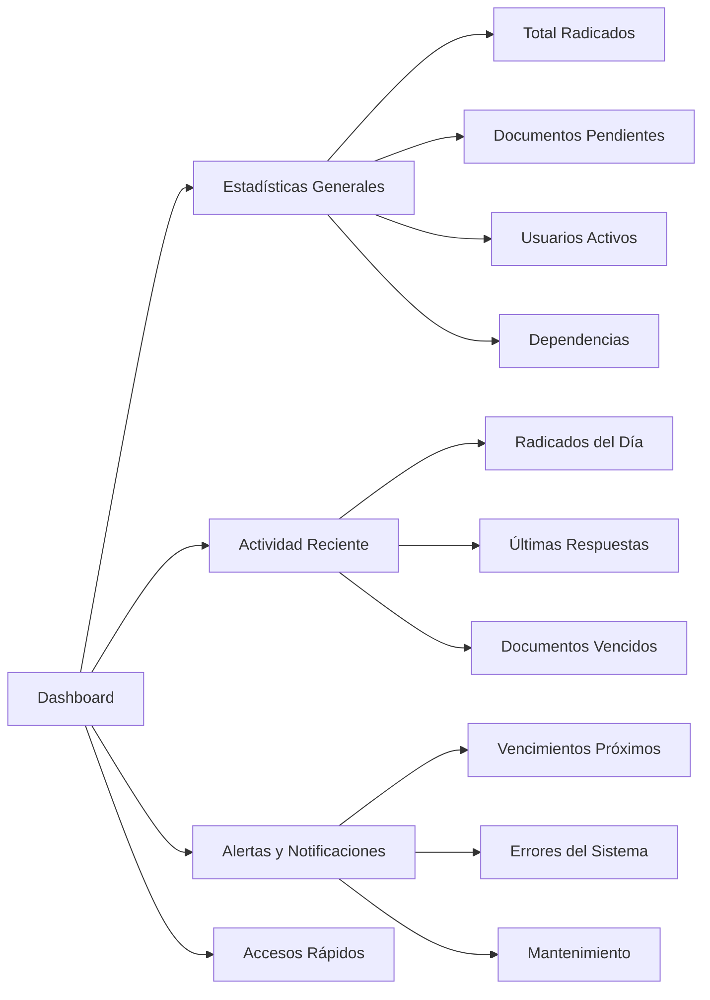

#### 🎯 Funcionalidades del Dashboard

| Componente | Descripción | Actualización |
|------------|-------------|---------------|
| **Contador de Radicados** | Total de documentos en el sistema | Tiempo real |
| **Documentos Pendientes** | Radicados sin responder | Cada 5 minutos |
| **Actividad del Día** | Radicados creados hoy | Tiempo real |
| **Usuarios Conectados** | Sesiones activas | Cada minuto |
| **Alertas de Vencimiento** | Documentos próximos a vencer | Cada hora |
| **Gráficos de Tendencias** | Análisis de productividad | Diario |

### 📋 Módulo de Radicación

#### 📥 Radicación de Entrada

Sistema para gestionar documentos externos dirigidos a la institución.

##### 🔄 Flujo de Proceso

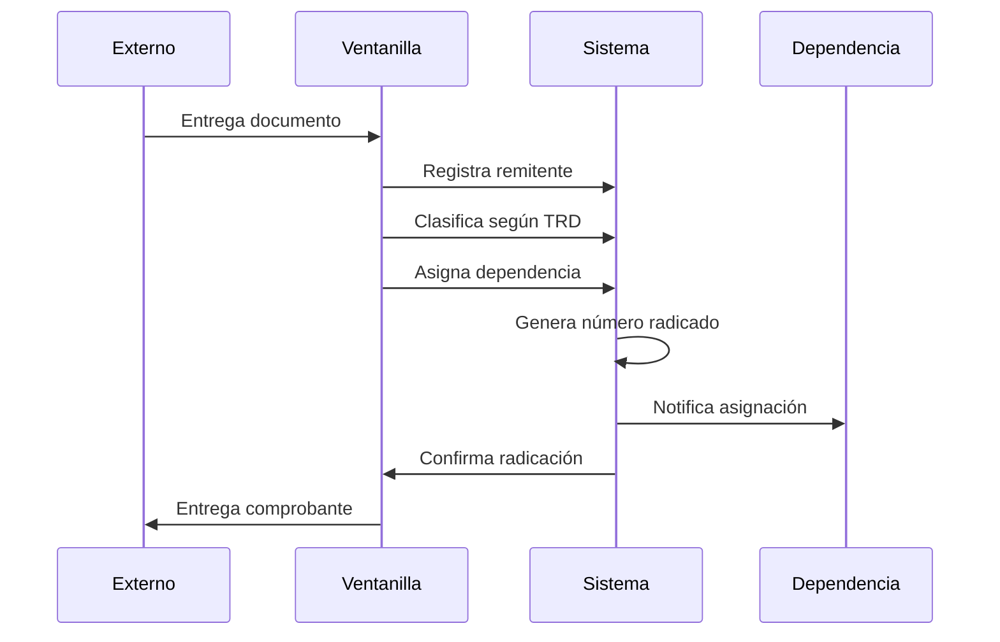

##### 📝 Campos del Formulario

| Campo | Tipo | Requerido | Validación |
|-------|------|-----------|------------|
| **Tipo de Remitente** | Select | ✅ | Anónimo/Registrado |
| **Documento de Identidad** | Text | ⚠️ | Solo si es registrado |
| **Nombre Completo** | Text | ✅ | Mínimo 3 caracteres |
| **Teléfono** | Text | ❌ | Formato colombiano |
| **Email** | Email | ❌ | Formato válido |
| **Dirección** | Textarea | ❌ | Máximo 500 caracteres |
| **Ciudad/Departamento** | Select | ❌ | Base de datos DANE |
| **Entidad** | Text | ❌ | Si representa organización |
| **Tipo de Documento** | Select | ✅ | Físico/Verbal |
| **Medio de Recepción** | Select | ✅ | Presencial/Correo/Fax/etc |
| **Clasificación TRD** | Hierarchical | ✅ | Unidad→Serie→Subserie |
| **Dependencia Destino** | Select | ✅ | Dependencias activas |
| **Número de Folios** | Number | ✅ | Mínimo 1 |
| **Observaciones** | Textarea | ❌ | Máximo 1000 caracteres |
| **Archivos Adjuntos** | File | ❌ | PDF, DOC, IMG |

##### 🎯 Características Especiales

- **Remitente Anónimo**: Para documentos sin identificación del remitente
- **Autocompletado**: Búsqueda inteligente de remitentes registrados
- **Validación en Tiempo Real**: Verificación inmediata de datos
- **Previsualización**: Vista previa antes de confirmar
- **Digitalización**: Captura de documentos físicos
- **Múltiples Archivos**: Soporte para varios adjuntos

#### 🏢 Radicación Interna

Gestión de comunicaciones entre dependencias de la institución.

##### 🔄 Flujo de Proceso

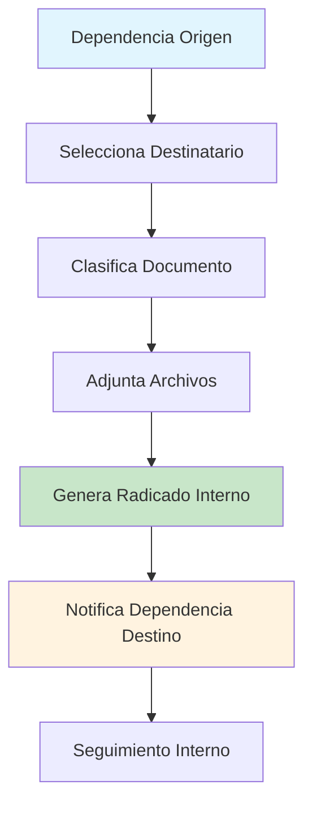

##### 📋 Características Específicas

- **Selección de Oficina Origen**: Dependencia que genera el documento
- **Múltiples Destinatarios**: Envío a varias dependencias simultáneamente
- **Copia de Conocimiento**: CC a dependencias adicionales
- **Prioridad**: Clasificación por urgencia (Normal/Urgente/Muy Urgente)
- **Seguimiento**: Confirmación de recepción y lectura
- **Respuesta Requerida**: Indicador si requiere respuesta

#### 📤 Radicación de Salida

Gestión de documentos institucionales dirigidos a entidades externas.

##### 🔄 Flujo de Proceso

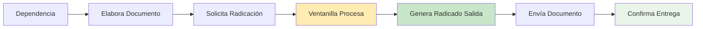

##### 📋 Características Específicas

- **Destinatario Externo**: Registro de entidades y personas externas
- **Método de Envío**: Correo físico, email, mensajería, personal
- **Seguimiento de Entrega**: Confirmación de recepción
- **Archivo Digital**: Copia digital del documento enviado
- **Plantillas**: Formatos predefinidos para documentos comunes

### 🔍 Módulo de Consultas

Sistema avanzado de búsqueda y consulta de documentos radicados.

#### 🔎 Tipos de Búsqueda

| Tipo | Descripción | Campos de Búsqueda |
|------|-------------|-------------------|
| **Por Radicado** | Búsqueda directa por número | Número de radicado |
| **Por Remitente** | Documentos de un remitente específico | Nombre, documento, email |
| **Por Dependencia** | Documentos de/para una dependencia | Dependencia origen/destino |
| **Por Fecha** | Rango de fechas de radicación | Fecha inicio/fin |
| **Por Estado** | Documentos en estado específico | Pendiente/Proceso/Respondido/Archivado |
| **Por TRD** | Clasificación documental | Unidad/Serie/Subserie |
| **Búsqueda Avanzada** | Combinación de múltiples criterios | Todos los campos |

#### 📊 Resultados de Búsqueda

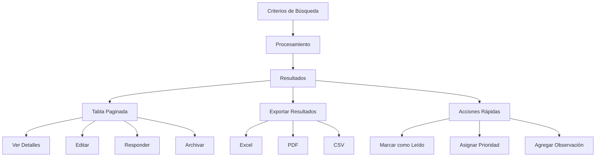

#### 🎯 Funcionalidades Avanzadas

- **Filtros Dinámicos**: Refinamiento progresivo de resultados
- **Búsqueda Inteligente**: Sugerencias automáticas
- **Historial de Búsquedas**: Búsquedas frecuentes guardadas
- **Alertas Personalizadas**: Notificaciones por criterios específicos
- **Exportación Masiva**: Descarga de resultados en múltiples formatos
- **Vista Previa Rápida**: Visualización sin abrir documento completo

### 📈 Módulo de Reportes

Sistema integral de generación de reportes y análisis estadístico.

#### 📊 Tipos de Reportes

##### 1. **Reportes Operativos**

| Reporte | Descripción | Frecuencia | Formato |
|---------|-------------|------------|---------|
| **Radicados por Período** | Documentos creados en rango de fechas | Diario/Semanal/Mensual | PDF, Excel |
| **Documentos Vencidos** | Radicados que superaron fecha límite | Diario | PDF, Email |
| **Productividad por Usuario** | Radicados procesados por operador | Semanal/Mensual | Excel, Gráfico |
| **Tiempos de Respuesta** | Análisis de cumplimiento de plazos | Mensual | Dashboard, PDF |
| **Estado de Radicados** | Distribución por estados | Tiempo Real | Dashboard |

##### 2. **Reportes Gerenciales**

| Reporte | Descripción | Audiencia | Automatización |
|---------|-------------|-----------|----------------|
| **Indicadores de Gestión** | KPIs del sistema | Gerencia | Mensual |
| **Análisis de Tendencias** | Patrones de radicación | Directivos | Trimestral |
| **Cumplimiento Normativo** | Adherencia a plazos legales | Auditoría | Mensual |
| **ROI del Sistema** | Retorno de inversión | Administración | Anual |
| **Satisfacción del Usuario** | Métricas de usabilidad | IT/UX | Semestral |

##### 3. **Reportes Técnicos**

| Reporte | Descripción | Usuario | Automatización |
|---------|-------------|---------|----------------|
| **Uso del Sistema** | Estadísticas de acceso | Administrador | Diario |
| **Rendimiento** | Métricas de performance | DevOps | Continuo |
| **Logs de Auditoría** | Registro de actividades | Seguridad | Tiempo Real |
| **Errores del Sistema** | Incidencias técnicas | Soporte | Inmediato |
| **Backup Status** | Estado de respaldos | Administrador | Diario |

#### 📈 Dashboard de Reportes

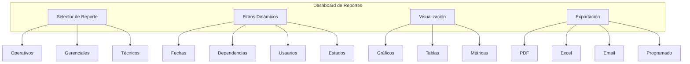

### ⚙️ Módulo de Administración

Centro de control para la configuración y gestión del sistema.

#### 👥 Gestión de Usuarios

##### 🔐 Roles y Permisos

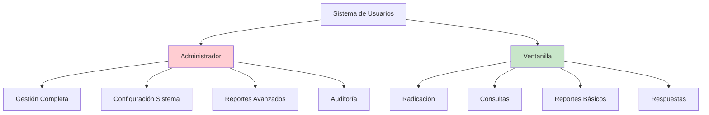

##### 📋 Funcionalidades de Gestión

| Funcionalidad | Administrador | Ventanilla | Descripción |
|---------------|---------------|------------|-------------|
| **Crear Usuarios** | ✅ | ❌ | Registro de nuevos operadores |
| **Editar Usuarios** | ✅ | ❌ | Modificación de datos de usuario |
| **Desactivar Usuarios** | ✅ | ❌ | Suspensión temporal de acceso |
| **Asignar Roles** | ✅ | ❌ | Cambio de permisos de usuario |
| **Ver Logs de Usuario** | ✅ | ❌ | Auditoría de actividades |
| **Resetear Contraseñas** | ✅ | ❌ | Recuperación de acceso |

#### 🏢 Gestión de Dependencias

##### 📊 Estructura Organizacional

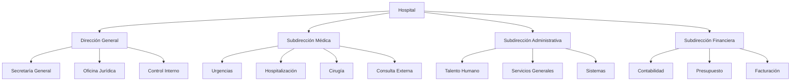

##### 🔧 Configuración de Dependencias

| Campo | Tipo | Requerido | Descripción |
|-------|------|-----------|-------------|
| **Código** | String(10) | ✅ | Identificador único |
| **Nombre** | String(255) | ✅ | Denominación completa |
| **Sigla** | String(20) | ❌ | Abreviatura |
| **Descripción** | Text | ❌ | Funciones y responsabilidades |
| **Responsable** | String(255) | ❌ | Jefe o coordinador |
| **Teléfono** | String(20) | ❌ | Extensión o número directo |
| **Email** | Email | ❌ | Correo institucional |
| **Estado** | Boolean | ✅ | Activa/Inactiva |

#### 📚 Gestión de TRD (Tabla de Retención Documental)

##### 🏗️ Estructura Jerárquica

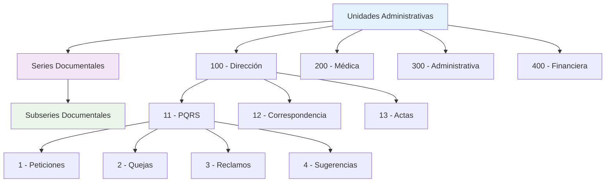

##### ⏱️ Tiempos de Respuesta

| Tipo de Documento | Días Hábiles | Base Legal |
|-------------------|--------------|------------|
| **Peticiones** | 15 | Código Contencioso Administrativo |
| **Quejas** | 15 | Código Contencioso Administrativo |
| **Reclamos** | 15 | Código Contencioso Administrativo |
| **Sugerencias** | 15 | Código Contencioso Administrativo |
| **Derechos de Petición** | 15 | Constitución Política Art. 23 |
| **Información Pública** | 10 | Ley 1712 de 2014 |
| **Habeas Data** | 10 | Ley 1581 de 2012 |
| **Tutelas** | 10 | Decreto 2591 de 1991 |

#### 🌍 Gestión Geográfica

##### 📍 Base de Datos DANE

El sistema incluye la división político-administrativa de Colombia según el DANE:

- **32 Departamentos** + Distrito Capital
- **1,122 Municipios** actualizados
- **Códigos DANE** oficiales
- **Integración automática** en formularios

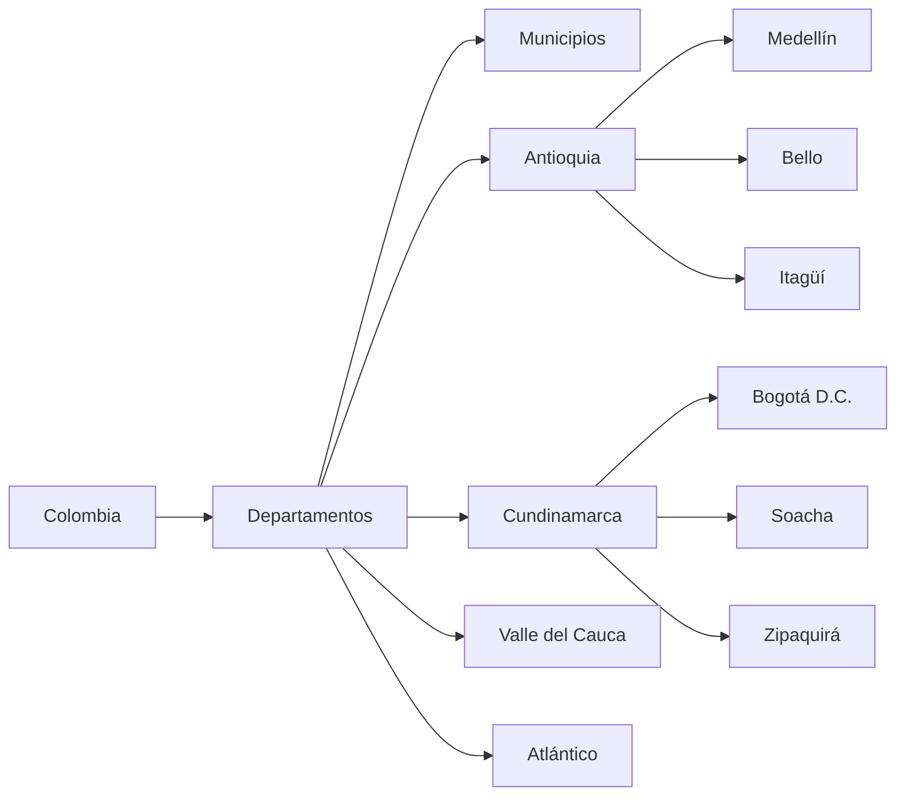

---

## 🗄️ Base de Datos

### 📊 Esquema de Base de Datos

#### 🏗️ Arquitectura de Datos

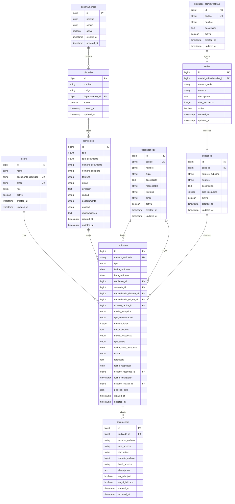

#### 📋 Descripción de Tablas

##### 👤 Tabla `users`
Gestión de usuarios del sistema con roles diferenciados.

| Campo | Tipo | Descripción | Restricciones |
|-------|------|-------------|---------------|
| `id` | BIGINT | Identificador único | PRIMARY KEY, AUTO_INCREMENT |
| `name` | VARCHAR(255) | Nombre completo del usuario | NOT NULL |
| `documento_identidad` | VARCHAR(20) | Documento de identidad | UNIQUE, NOT NULL |
| `email` | VARCHAR(255) | Correo electrónico | UNIQUE, NOT NULL |
| `role` | ENUM | Rol del usuario | 'administrador', 'ventanilla' |
| `active` | BOOLEAN | Estado del usuario | DEFAULT TRUE |

##### 📄 Tabla `radicados`
Tabla principal que almacena todos los documentos radicados.

| Campo | Tipo | Descripción | Restricciones |
|-------|------|-------------|---------------|
| `id` | BIGINT | Identificador único | PRIMARY KEY, AUTO_INCREMENT |
| `numero_radicado` | VARCHAR(20) | Número consecutivo único | UNIQUE, NOT NULL |
| `tipo` | ENUM | Tipo de radicado | 'entrada', 'interno', 'salida' |
| `fecha_radicado` | DATE | Fecha de radicación | NOT NULL |
| `hora_radicado` | TIME | Hora de radicación | NOT NULL |
| `estado` | ENUM | Estado actual | 'pendiente', 'en_proceso', 'respondido', 'archivado' |
| `numero_folios` | INTEGER | Cantidad de folios | NOT NULL, MIN 1 |
| `fecha_limite_respuesta` | DATE | Fecha límite para respuesta | NULLABLE |
| `posicion_sello` | JSON | Coordenadas del sello digital | NULLABLE |

##### 👥 Tabla `remitentes`
Base de datos de personas naturales y jurídicas.

| Campo | Tipo | Descripción | Restricciones |
|-------|------|-------------|---------------|
| `id` | BIGINT | Identificador único | PRIMARY KEY, AUTO_INCREMENT |
| `tipo` | ENUM | Tipo de remitente | 'anonimo', 'registrado' |
| `tipo_documento` | ENUM | Tipo de documento | 'CC', 'CE', 'TI', 'PP', 'NIT', 'OTRO' |
| `numero_documento` | VARCHAR(20) | Número de documento | NULLABLE |
| `nombre_completo` | VARCHAR(255) | Nombre completo | NOT NULL |
| `telefono` | VARCHAR(20) | Teléfono de contacto | NULLABLE |
| `email` | VARCHAR(255) | Correo electrónico | NULLABLE |

#### 🔗 Relaciones y Claves Foráneas

```sql
-- Relaciones principales
ALTER TABLE radicados
ADD CONSTRAINT fk_radicados_remitente
FOREIGN KEY (remitente_id) REFERENCES remitentes(id) ON DELETE RESTRICT;

ALTER TABLE radicados
ADD CONSTRAINT fk_radicados_subserie
FOREIGN KEY (subserie_id) REFERENCES subseries(id) ON DELETE RESTRICT;

ALTER TABLE radicados
ADD CONSTRAINT fk_radicados_dependencia_destino
FOREIGN KEY (dependencia_destino_id) REFERENCES dependencias(id) ON DELETE RESTRICT;

ALTER TABLE radicados
ADD CONSTRAINT fk_radicados_dependencia_origen
FOREIGN KEY (dependencia_origen_id) REFERENCES dependencias(id) ON DELETE RESTRICT;

ALTER TABLE radicados
ADD CONSTRAINT fk_radicados_usuario_radica
FOREIGN KEY (usuario_radica_id) REFERENCES users(id) ON DELETE SET NULL;

-- Relaciones TRD jerárquico
ALTER TABLE series
ADD CONSTRAINT fk_series_unidad_administrativa
FOREIGN KEY (unidad_administrativa_id) REFERENCES unidades_administrativas(id) ON DELETE RESTRICT;

ALTER TABLE subseries
ADD CONSTRAINT fk_subseries_serie
FOREIGN KEY (serie_id) REFERENCES series(id) ON DELETE RESTRICT;

-- Relaciones de documentos
ALTER TABLE documentos
ADD CONSTRAINT fk_documentos_radicado
FOREIGN KEY (radicado_id) REFERENCES radicados(id) ON DELETE CASCADE;

-- Relaciones geográficas
ALTER TABLE ciudades
ADD CONSTRAINT fk_ciudades_departamento
FOREIGN KEY (departamento_id) REFERENCES departamentos(id) ON DELETE CASCADE;
```

#### 📊 Índices de Rendimiento

```sql
-- Índices para optimización de consultas
CREATE INDEX idx_radicados_numero ON radicados(numero_radicado);
CREATE INDEX idx_radicados_tipo ON radicados(tipo);
CREATE INDEX idx_radicados_fecha ON radicados(fecha_radicado);
CREATE INDEX idx_radicados_estado ON radicados(estado);
CREATE INDEX idx_radicados_dependencia_destino ON radicados(dependencia_destino_id);
CREATE INDEX idx_radicados_fecha_limite ON radicados(fecha_limite_respuesta);

CREATE INDEX idx_remitentes_tipo ON remitentes(tipo);
CREATE INDEX idx_remitentes_documento ON remitentes(numero_documento);
CREATE INDEX idx_remitentes_tipo_documento ON remitentes(tipo_documento, numero_documento);

CREATE INDEX idx_dependencias_activa ON dependencias(activa);
CREATE INDEX idx_dependencias_codigo ON dependencias(codigo);

CREATE INDEX idx_series_activa ON series(activa);
CREATE INDEX idx_subseries_activa ON subseries(activa);

CREATE INDEX idx_documentos_radicado ON documentos(radicado_id);
CREATE INDEX idx_documentos_principal ON documentos(es_principal);
```

#### 🔄 Migraciones del Sistema

El sistema utiliza migraciones de Laravel para el control de versiones de la base de datos:

| Migración | Descripción | Fecha |
|-----------|-------------|-------|
| `0001_01_01_000000_create_users_table` | Tabla de usuarios y autenticación | 2025-06-01 |
| `2025_06_09_162111_create_dependencias_table` | Estructura organizacional | 2025-06-09 |
| `2025_06_09_162144_create_remitentes_table` | Base de datos de remitentes | 2025-06-09 |
| `2025_06_09_162156_create_radicados_table` | Tabla principal de radicados | 2025-06-09 |
| `2025_06_09_162207_create_documentos_table` | Gestión de archivos adjuntos | 2025-06-09 |
| `2025_06_22_165137_create_ciudads_table` | División geográfica | 2025-06-22 |
| `2025_06_27_120000_create_unidades_administrativas_table` | TRD jerárquico - Unidades | 2025-06-27 |
| `2025_06_27_120001_create_series_table` | TRD jerárquico - Series | 2025-06-27 |
| `2025_06_27_120002_create_subseries_table` | TRD jerárquico - Subseries | 2025-06-27 |
| `2025_06_30_135039_remove_trd_id_from_radicados_table` | Migración a TRD jerárquico | 2025-06-30 |
| `2025_06_30_150000_add_finalization_fields_to_radicados_table` | Campos de finalización | 2025-06-30 |
| `2025_06_30_150001_add_digitalized_field_to_documentos_table` | Digitalización de documentos | 2025-06-30 |

#### 📈 Estadísticas de Base de Datos

```sql
-- Consultas de estadísticas útiles
SELECT
    COUNT(*) as total_radicados,
    COUNT(CASE WHEN estado = 'pendiente' THEN 1 END) as pendientes,
    COUNT(CASE WHEN estado = 'respondido' THEN 1 END) as respondidos,
    COUNT(CASE WHEN fecha_limite_respuesta < CURDATE() AND estado != 'respondido' THEN 1 END) as vencidos
FROM radicados;

-- Productividad por usuario
SELECT
    u.name,
    COUNT(r.id) as radicados_creados,
    COUNT(CASE WHEN r.estado = 'respondido' THEN 1 END) as respondidos
FROM users u
LEFT JOIN radicados r ON u.id = r.usuario_radica_id
GROUP BY u.id, u.name
ORDER BY radicados_creados DESC;

-- Radicados por dependencia
SELECT
    d.nombre,
    COUNT(r.id) as total_radicados,
    AVG(DATEDIFF(r.fecha_respuesta, r.fecha_radicado)) as promedio_dias_respuesta
FROM dependencias d
LEFT JOIN radicados r ON d.id = r.dependencia_destino_id
GROUP BY d.id, d.nombre
ORDER BY total_radicados DESC;
```

---

## 🔌 API y Endpoints

### 🌐 Arquitectura de API

El sistema UniRadic expone una API RESTful para integración con sistemas externos y aplicaciones móviles.

#### 📋 Endpoints Principales

##### 🔐 Autenticación

| Método | Endpoint | Descripción | Autenticación |
|--------|----------|-------------|---------------|
| `POST` | `/api/auth/login` | Iniciar sesión | No |
| `POST` | `/api/auth/logout` | Cerrar sesión | Bearer Token |
| `GET` | `/api/auth/user` | Obtener usuario actual | Bearer Token |
| `POST` | `/api/auth/refresh` | Renovar token | Bearer Token |

##### 📄 Radicados

| Método | Endpoint | Descripción | Parámetros |
|--------|----------|-------------|------------|
| `GET` | `/api/radicados` | Listar radicados | `page`, `per_page`, `tipo`, `estado` |
| `POST` | `/api/radicados` | Crear radicado | JSON con datos del radicado |
| `GET` | `/api/radicados/{id}` | Obtener radicado específico | `id` del radicado |
| `PUT` | `/api/radicados/{id}` | Actualizar radicado | `id` + JSON con cambios |
| `DELETE` | `/api/radicados/{id}` | Eliminar radicado | `id` del radicado |
| `GET` | `/api/radicados/search` | Búsqueda avanzada | Múltiples filtros |

##### 👥 Remitentes

| Método | Endpoint | Descripción | Parámetros |
|--------|----------|-------------|------------|
| `GET` | `/api/remitentes` | Listar remitentes | `page`, `per_page`, `tipo` |
| `POST` | `/api/remitentes` | Crear remitente | JSON con datos |
| `GET` | `/api/remitentes/{id}` | Obtener remitente | `id` del remitente |
| `PUT` | `/api/remitentes/{id}` | Actualizar remitente | `id` + JSON |
| `GET` | `/api/remitentes/search` | Buscar remitentes | `q`, `tipo_documento`, `numero_documento` |

##### 🏢 Dependencias

| Método | Endpoint | Descripción | Parámetros |
|--------|----------|-------------|------------|
| `GET` | `/api/dependencias` | Listar dependencias | `activa` |
| `POST` | `/api/dependencias` | Crear dependencia | JSON con datos |
| `GET` | `/api/dependencias/{id}` | Obtener dependencia | `id` |
| `PUT` | `/api/dependencias/{id}` | Actualizar dependencia | `id` + JSON |

##### 📚 TRD (Tabla de Retención Documental)

| Método | Endpoint | Descripción | Parámetros |
|--------|----------|-------------|------------|
| `GET` | `/api/trd/unidades-administrativas` | Listar unidades | `activa` |
| `GET` | `/api/trd/series` | Listar series | `unidad_administrativa_id` |
| `GET` | `/api/trd/subseries` | Listar subseries | `serie_id` |
| `GET` | `/api/trd/jerarquia` | Estructura completa TRD | - |

#### 📝 Ejemplos de Uso de API

##### Crear un Radicado de Entrada

```bash
curl -X POST http://uniradic.local/api/radicados \
  -H "Authorization: Bearer YOUR_TOKEN" \
  -H "Content-Type: application/json" \
  -d '{
    "tipo": "entrada",
    "remitente": {
      "tipo": "registrado",
      "tipo_documento": "CC",
      "numero_documento": "12345678",
      "nombre_completo": "Juan Pérez García",
      "telefono": "3001234567",
      "email": "juan.perez@email.com"
    },
    "subserie_id": 1,
    "dependencia_destino_id": 5,
    "medio_recepcion": "presencial",
    "tipo_comunicacion": "fisico",
    "numero_folios": 3,
    "observaciones": "Solicitud de información médica"
  }'
```

##### Buscar Radicados

```bash
curl -X GET "http://uniradic.local/api/radicados/search?estado=pendiente&fecha_desde=2025-01-01&dependencia_destino_id=5" \
  -H "Authorization: Bearer YOUR_TOKEN"
```

##### Respuesta de API

```json
{
  "success": true,
  "data": {
    "id": 123,
    "numero_radicado": "E-2025-000123",
    "tipo": "entrada",
    "fecha_radicado": "2025-01-15",
    "hora_radicado": "14:30:00",
    "estado": "pendiente",
    "remitente": {
      "id": 45,
      "nombre_completo": "Juan Pérez García",
      "tipo_documento": "CC",
      "numero_documento": "12345678"
    },
    "dependencia_destino": {
      "id": 5,
      "codigo": "DIR001",
      "nombre": "Dirección General"
    },
    "subserie": {
      "id": 1,
      "nombre": "Peticiones",
      "serie": {
        "nombre": "PQRS",
        "unidad_administrativa": {
          "nombre": "Dirección"
        }
      }
    },
    "numero_folios": 3,
    "fecha_limite_respuesta": "2025-02-05",
    "created_at": "2025-01-15T14:30:00Z",
    "updated_at": "2025-01-15T14:30:00Z"
  },
  "message": "Radicado creado exitosamente"
}
```

#### 🔒 Autenticación y Seguridad de API

##### Autenticación Bearer Token

```php
// Middleware de autenticación API
Route::middleware('auth:sanctum')->group(function () {
    Route::apiResource('radicados', RadicadoApiController::class);
    Route::apiResource('remitentes', RemitenteApiController::class);
    Route::apiResource('dependencias', DependenciaApiController::class);
});
```

##### Rate Limiting

```php
// Limitación de velocidad por usuario
Route::middleware(['auth:sanctum', 'throttle:60,1'])->group(function () {
    // 60 requests per minute per user
});

// Limitación para endpoints públicos
Route::middleware('throttle:10,1')->group(function () {
    // 10 requests per minute for public endpoints
});
```

##### Validación de Requests

```php
class CreateRadicadoRequest extends FormRequest
{
    public function rules()
    {
        return [
            'tipo' => 'required|in:entrada,interno,salida',
            'remitente.nombre_completo' => 'required|string|min:3|max:255',
            'remitente.tipo_documento' => 'required|in:CC,CE,TI,PP,NIT,OTRO',
            'subserie_id' => 'required|exists:subseries,id',
            'dependencia_destino_id' => 'required|exists:dependencias,id',
            'numero_folios' => 'required|integer|min:1',
            'observaciones' => 'nullable|string|max:1000'
        ];
    }
}
```

#### 📊 Códigos de Respuesta HTTP

| Código | Descripción | Uso |
|--------|-------------|-----|
| `200` | OK | Operación exitosa |
| `201` | Created | Recurso creado exitosamente |
| `400` | Bad Request | Datos de entrada inválidos |
| `401` | Unauthorized | Token de autenticación inválido |
| `403` | Forbidden | Sin permisos para la operación |
| `404` | Not Found | Recurso no encontrado |
| `422` | Unprocessable Entity | Errores de validación |
| `429` | Too Many Requests | Límite de velocidad excedido |
| `500` | Internal Server Error | Error interno del servidor |

#### 📈 Monitoreo de API

```php
// Middleware de logging para API
class ApiLoggingMiddleware
{
    public function handle($request, Closure $next)
    {
        $startTime = microtime(true);

        $response = $next($request);

        $duration = microtime(true) - $startTime;

        Log::info('API Request', [
            'method' => $request->method(),
            'url' => $request->fullUrl(),
            'user_id' => auth()->id(),
            'ip' => $request->ip(),
            'user_agent' => $request->userAgent(),
            'status_code' => $response->getStatusCode(),
            'duration_ms' => round($duration * 1000, 2),
            'memory_usage' => memory_get_peak_usage(true)
        ]);

        return $response;
    }
}
```

---

## 🔐 Seguridad

### 🛡️ Medidas de Seguridad Implementadas

#### 🔒 Autenticación y Autorización

##### Sistema de Autenticación

```php
// Configuración de autenticación en config/auth.php
'guards' => [
    'web' => [
        'driver' => 'session',
        'provider' => 'users',
    ],
    'api' => [
        'driver' => 'sanctum',
        'provider' => 'users',
    ],
],

'providers' => [
    'users' => [
        'driver' => 'eloquent',
        'model' => App\Models\User::class,
    ],
],
```

##### Control de Roles

```php
// Middleware CheckRole
class CheckRole
{
    public function handle($request, Closure $next, $role)
    {
        if (!auth()->check()) {
            return redirect()->route('login');
        }

        if (!auth()->user()->hasRole($role)) {
            abort(403, 'No tienes permisos para acceder a esta sección');
        }

        return $next($request);
    }
}

// Uso en rutas
Route::middleware(['auth', 'role:administrador'])->group(function () {
    Route::get('/admin', [AdminController::class, 'index']);
});
```

##### Timeout de Sesión

```php
// Middleware SessionTimeout
class SessionTimeout
{
    public function handle($request, Closure $next)
    {
        $timeout = config('session.lifetime') * 60; // 5 minutos

        if (session('last_activity') &&
            (time() - session('last_activity')) > $timeout) {

            auth()->logout();
            session()->flush();

            return redirect()->route('login')
                ->with('message', 'Sesión expirada por inactividad');
        }

        session(['last_activity' => time()]);

        return $next($request);
    }
}
```

#### 🔐 Protección de Datos

##### Validación de Entrada

```php
// Validación robusta en FormRequests
class RadicacionEntradaRequest extends FormRequest
{
    public function rules()
    {
        return [
            'remitente.nombre_completo' => [
                'required',
                'string',
                'min:3',
                'max:255',
                'regex:/^[a-zA-ZáéíóúÁÉÍÓÚñÑ\s]+$/'
            ],
            'remitente.numero_documento' => [
                'required_if:remitente.tipo,registrado',
                'string',
                'max:20',
                'regex:/^[0-9]+$/'
            ],
            'remitente.email' => [
                'nullable',
                'email:rfc,dns',
                'max:255'
            ],
            'numero_folios' => [
                'required',
                'integer',
                'min:1',
                'max:1000'
            ],
            'observaciones' => [
                'nullable',
                'string',
                'max:1000',
                function ($attribute, $value, $fail) {
                    if (preg_match('/<script|javascript:|on\w+=/i', $value)) {
                        $fail('El campo contiene contenido no permitido.');
                    }
                }
            ]
        ];
    }

    public function messages()
    {
        return [
            'remitente.nombre_completo.regex' => 'El nombre solo puede contener letras y espacios.',
            'remitente.numero_documento.regex' => 'El documento solo puede contener números.',
            'remitente.email.email' => 'El formato del email no es válido.',
        ];
    }
}
```

##### Sanitización de Archivos

```php
// Validación y sanitización de archivos
class FileUploadService
{
    private $allowedMimeTypes = [
        'application/pdf',
        'application/msword',
        'application/vnd.openxmlformats-officedocument.wordprocessingml.document',
        'image/jpeg',
        'image/png',
        'image/gif'
    ];

    private $maxFileSize = 10485760; // 10MB

    public function validateAndStore($file, $radicadoId)
    {
        // Validar tipo MIME
        if (!in_array($file->getMimeType(), $this->allowedMimeTypes)) {
            throw new InvalidFileTypeException('Tipo de archivo no permitido');
        }

        // Validar tamaño
        if ($file->getSize() > $this->maxFileSize) {
            throw new FileTooLargeException('Archivo demasiado grande');
        }

        // Generar nombre seguro
        $filename = $this->generateSecureFilename($file);

        // Calcular hash para integridad
        $hash = hash_file('sha256', $file->getPathname());

        // Almacenar archivo
        $path = $file->storeAs(
            "radicados/{$radicadoId}",
            $filename,
            'private'
        );

        return [
            'path' => $path,
            'filename' => $filename,
            'hash' => $hash,
            'size' => $file->getSize(),
            'mime_type' => $file->getMimeType()
        ];
    }

    private function generateSecureFilename($file)
    {
        $extension = $file->getClientOriginalExtension();
        $timestamp = now()->format('YmdHis');
        $random = Str::random(8);

        return "{$timestamp}_{$random}.{$extension}";
    }
}
```

#### 🛡️ Protección CSRF

```php
// Configuración CSRF en config/session.php
'same_site' => 'strict',
'secure' => env('SESSION_SECURE_COOKIE', true),
'http_only' => true,

// Middleware CSRF aplicado globalmente
'web' => [
    \App\Http\Middleware\EncryptCookies::class,
    \Illuminate\Cookie\Middleware\AddQueuedCookiesToResponse::class,
    \Illuminate\Session\Middleware\StartSession::class,
    \Illuminate\View\Middleware\ShareErrorsFromSession::class,
    \App\Http\Middleware\VerifyCsrfToken::class,
    \Illuminate\Routing\Middleware\SubstituteBindings::class,
],
```

#### 🔍 Logging y Auditoría

```php
// Sistema de auditoría
class AuditLogger
{
    public static function log($action, $model = null, $changes = [])
    {
        Log::channel('audit')->info('User Action', [
            'user_id' => auth()->id(),
            'user_name' => auth()->user()->name ?? 'Sistema',
            'action' => $action,
            'model' => $model ? get_class($model) : null,
            'model_id' => $model ? $model->id : null,
            'changes' => $changes,
            'ip_address' => request()->ip(),
            'user_agent' => request()->userAgent(),
            'timestamp' => now()->toISOString()
        ]);
    }
}

// Uso en modelos
class Radicado extends Model
{
    protected static function booted()
    {
        static::created(function ($radicado) {
            AuditLogger::log('radicado_created', $radicado);
        });

        static::updated(function ($radicado) {
            AuditLogger::log('radicado_updated', $radicado, $radicado->getChanges());
        });

        static::deleted(function ($radicado) {
            AuditLogger::log('radicado_deleted', $radicado);
        });
    }
}
```

#### 🔒 Headers de Seguridad

```php
// Middleware SecurityHeaders
class SecurityHeaders
{
    public function handle($request, Closure $next)
    {
        $response = $next($request);

        $response->headers->set('X-Content-Type-Options', 'nosniff');
        $response->headers->set('X-Frame-Options', 'DENY');
        $response->headers->set('X-XSS-Protection', '1; mode=block');
        $response->headers->set('Referrer-Policy', 'strict-origin-when-cross-origin');
        $response->headers->set('Permissions-Policy', 'geolocation=(), microphone=(), camera=()');

        if (app()->environment('production')) {
            $response->headers->set('Strict-Transport-Security', 'max-age=31536000; includeSubDomains');
        }

        return $response;
    }
}
```

### 🔐 Configuración de Seguridad en Producción

#### SSL/TLS Configuration

```nginx
# Configuración Nginx con SSL
server {
    listen 443 ssl http2;
    server_name uniradic.hospital.com;

    ssl_certificate /path/to/certificate.crt;
    ssl_certificate_key /path/to/private.key;

    ssl_protocols TLSv1.2 TLSv1.3;
    ssl_ciphers ECDHE-RSA-AES256-GCM-SHA512:DHE-RSA-AES256-GCM-SHA512:ECDHE-RSA-AES256-GCM-SHA384;
    ssl_prefer_server_ciphers off;

    add_header Strict-Transport-Security "max-age=63072000" always;
    add_header X-Frame-Options DENY;
    add_header X-Content-Type-Options nosniff;
    add_header X-XSS-Protection "1; mode=block";

    root /var/www/uniradic/public;
    index index.php;

    location / {
        try_files $uri $uri/ /index.php?$query_string;
    }

    location ~ \.php$ {
        fastcgi_pass unix:/var/run/php/php8.2-fpm.sock;
        fastcgi_index index.php;
        fastcgi_param SCRIPT_FILENAME $realpath_root$fastcgi_script_name;
        include fastcgi_params;

        fastcgi_hide_header X-Powered-By;
    }

    location ~ /\.ht {
        deny all;
    }

    location /storage {
        deny all;
    }
}

# Redirección HTTP a HTTPS
server {
    listen 80;
    server_name uniradic.hospital.com;
    return 301 https://$server_name$request_uri;
}
```

#### Firewall Configuration

```bash
# Configuración UFW (Ubuntu)
ufw --force reset
ufw default deny incoming
ufw default allow outgoing

# SSH (cambiar puerto por defecto)
ufw allow 2222/tcp

# HTTP/HTTPS
ufw allow 80/tcp
ufw allow 443/tcp

# MySQL (solo desde localhost)
ufw allow from 127.0.0.1 to any port 3306

# Activar firewall
ufw --force enable

# Verificar estado
ufw status verbose
```

---

## 🔄 Flujos de Trabajo

### 📋 Flujo de Radicación de Entrada

#### 🔄 Diagrama de Proceso

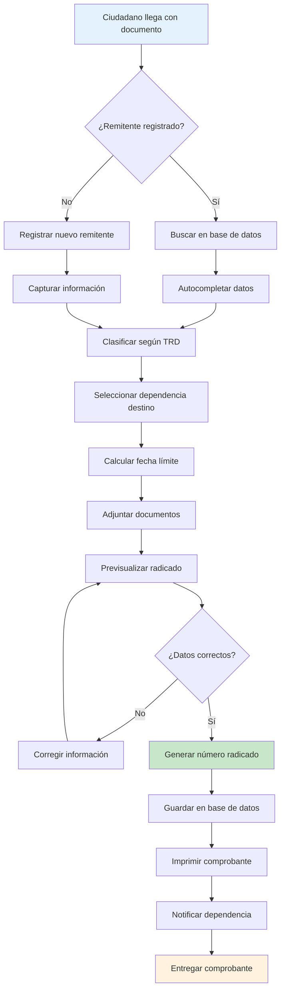

#### 📝 Pasos Detallados

1. **Recepción del Documento**
   - Ciudadano se presenta en ventanilla
   - Entrega documento físico o verbal
   - Operador verifica completitud

2. **Identificación del Remitente**
   - Búsqueda por documento de identidad
   - Si existe: autocompletar datos
   - Si no existe: registrar nuevo remitente

3. **Clasificación Documental**
   - Seleccionar Unidad Administrativa
   - Elegir Serie documental
   - Especificar Subserie
   - Sistema calcula automáticamente fecha límite

4. **Asignación de Dependencia**
   - Seleccionar dependencia destino
   - Verificar que esté activa
   - Confirmar responsable

5. **Digitalización (Opcional)**
   - Escanear documento físico
   - Adjuntar archivos digitales
   - Validar formato y tamaño

6. **Generación del Radicado**
   - Sistema asigna número consecutivo
   - Formato: E-YYYY-NNNNNN
   - Registro en base de datos

7. **Notificación y Entrega**
   - Imprimir comprobante con código QR
   - Notificar por email a dependencia
   - Entregar comprobante al ciudadano

### 🏢 Flujo de Radicación Interna

#### 🔄 Diagrama de Proceso

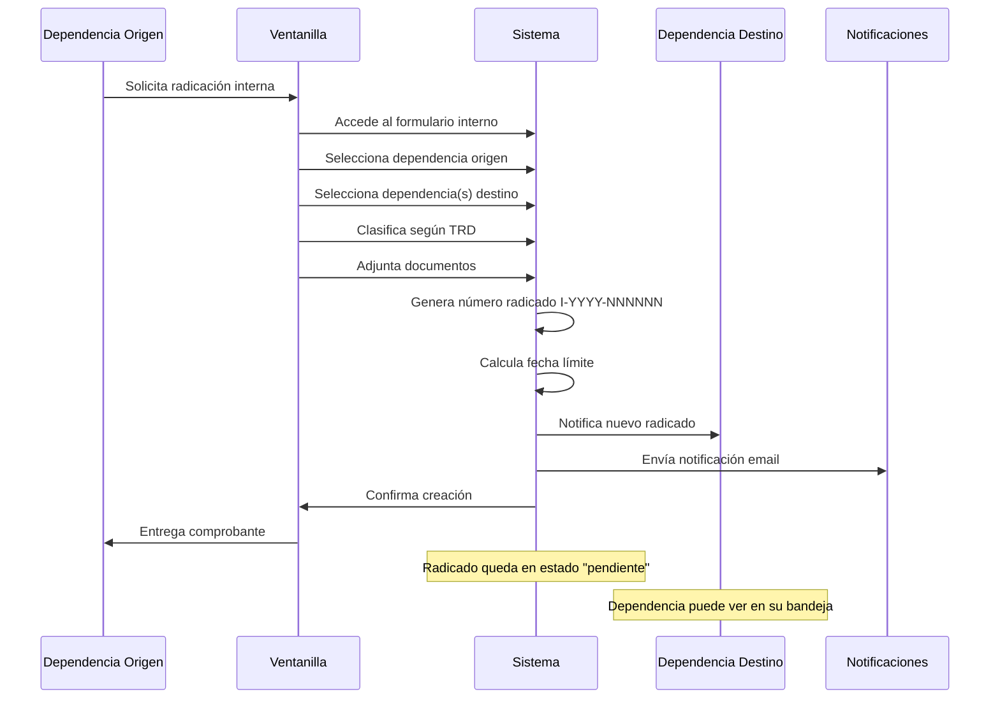

#### 📋 Características Específicas

- **Múltiples Destinatarios**: Un radicado interno puede dirigirse a varias dependencias
- **Copia de Conocimiento**: Envío informativo sin requerir respuesta
- **Prioridad**: Normal, Urgente, Muy Urgente
- **Seguimiento**: Confirmación de lectura y estado
- **Respuesta Requerida**: Indicador booleano

### 📤 Flujo de Radicación de Salida

#### 🔄 Diagrama de Proceso

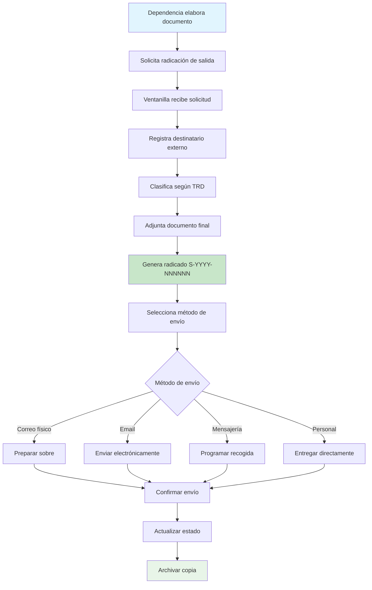

### 🔍 Flujo de Consulta y Seguimiento

#### 📊 Tipos de Consulta

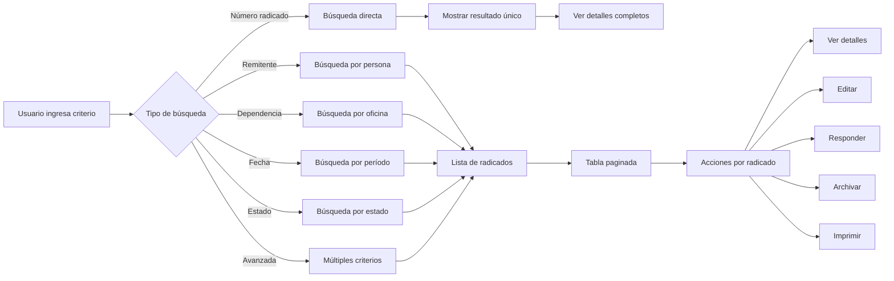

### 📝 Flujo de Respuesta

#### 🔄 Proceso de Respuesta

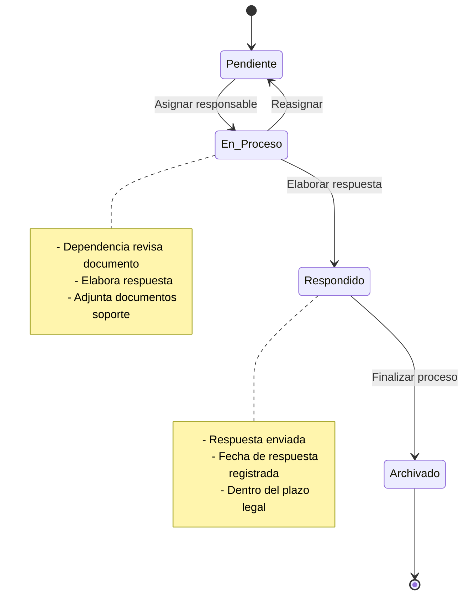

#### 📋 Pasos del Proceso de Respuesta

1. **Recepción en Dependencia**
   - Notificación automática por email
   - Aparece en bandeja de entrada
   - Asignación a funcionario responsable

2. **Análisis del Documento**
   - Revisión de la solicitud
   - Verificación de competencia
   - Consulta de antecedentes

3. **Elaboración de Respuesta**
   - Redacción de respuesta oficial
   - Revisión jurídica (si aplica)
   - Aprobación por superior

4. **Registro en Sistema**
   - Captura de respuesta en sistema
   - Adjuntar documentos soporte
   - Actualizar estado a "respondido"

5. **Envío al Ciudadano**
   - Notificación automática
   - Envío por medio seleccionado
   - Confirmación de entrega

### 🔄 Flujo de Estados

#### 📊 Diagrama de Estados

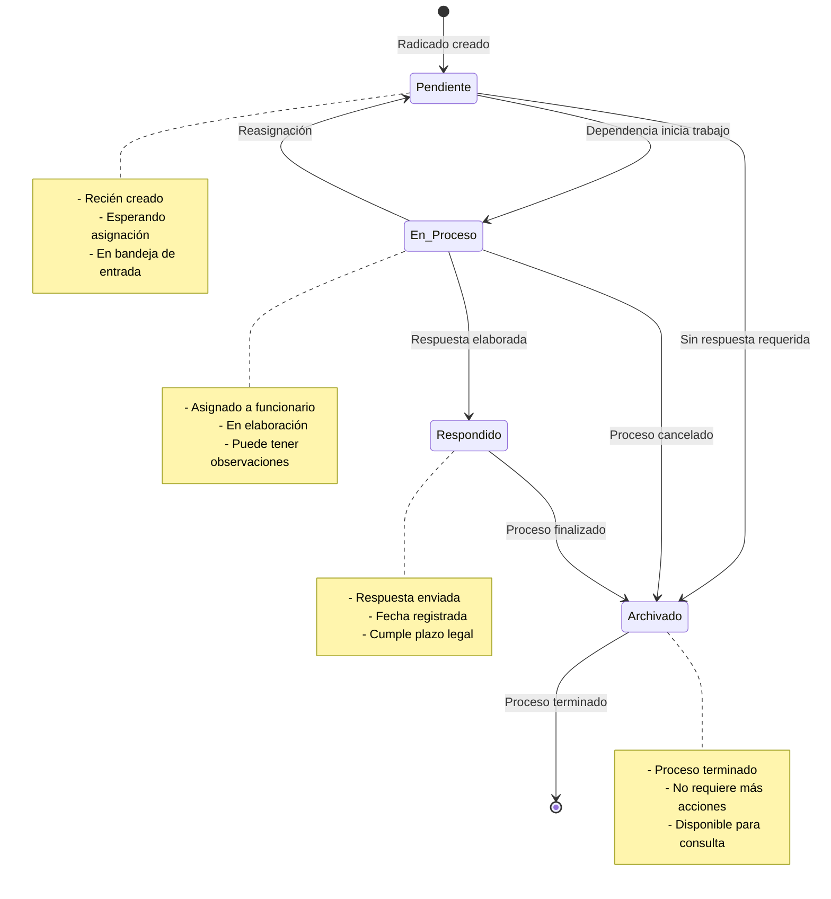

#### ⏱️ Control de Tiempos

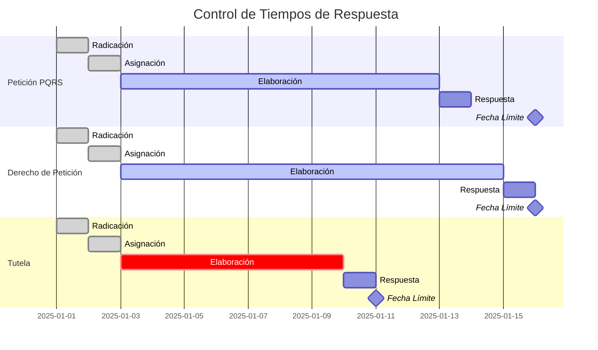

---

## 🎨 Interfaz de Usuario

### 🖥️ Diseño y Experiencia de Usuario

#### 🎯 Principios de Diseño

1. **Simplicidad**: Interfaces limpias y minimalistas
2. **Consistencia**: Patrones de diseño uniformes
3. **Accesibilidad**: Cumplimiento WCAG 2.1 AA
4. **Responsividad**: Adaptación a todos los dispositivos
5. **Eficiencia**: Flujos optimizados para productividad

#### 🎨 Sistema de Diseño

##### Paleta de Colores

```css
:root {
  /* Colores primarios */
  --primary-50: #eff6ff;
  --primary-100: #dbeafe;
  --primary-200: #bfdbfe;
  --primary-300: #93c5fd;
  --primary-400: #60a5fa;
  --primary-500: #082ca4;  /* Color institucional */
  --primary-600: #082ca4;
  --primary-700: #082ca4;
  --primary-800: #082ca4;
  --primary-900: #082ca4;

  /* Colores de estado */
  --success: #10b981;
  --warning: #f59e0b;
  --error: #ef4444;
  --info: #3b82f6;

  /* Colores neutros */
  --gray-50: #f9fafb;
  --gray-100: #f3f4f6;
  --gray-200: #e5e7eb;
  --gray-300: #d1d5db;
  --gray-400: #9ca3af;
  --gray-500: #6b7280;
  --gray-600: #4b5563;
  --gray-700: #374151;
  --gray-800: #1f2937;
  --gray-900: #111827;
}
```

##### Tipografía

```css
/* Fuentes del sistema */
.font-sans {
  font-family: 'Figtree', 'Inter', 'Segoe UI', 'Roboto', 'Helvetica Neue', 'Arial', sans-serif;
}

/* Escalas tipográficas */
.text-xs { font-size: 0.75rem; line-height: 1rem; }
.text-sm { font-size: 0.875rem; line-height: 1.25rem; }
.text-base { font-size: 1rem; line-height: 1.5rem; }
.text-lg { font-size: 1.125rem; line-height: 1.75rem; }
.text-xl { font-size: 1.25rem; line-height: 1.75rem; }
.text-2xl { font-size: 1.5rem; line-height: 2rem; }
.text-3xl { font-size: 1.875rem; line-height: 2.25rem; }
```

#### 📱 Componentes de UI

##### Botones

```html
<!-- Botón primario -->
<button class="bg-primary-500 hover:bg-primary-600 text-white font-medium py-2 px-4 rounded-lg transition-colors duration-200">
  Crear Radicado
</button>

<!-- Botón secundario -->
<button class="bg-gray-200 hover:bg-gray-300 text-gray-800 font-medium py-2 px-4 rounded-lg transition-colors duration-200">
  Cancelar
</button>

<!-- Botón de peligro -->
<button class="bg-red-500 hover:bg-red-600 text-white font-medium py-2 px-4 rounded-lg transition-colors duration-200">
  Eliminar
</button>
```

##### Formularios

```html
<!-- Campo de entrada -->
<div class="mb-4">
  <label for="nombre" class="block text-sm font-medium text-gray-700 mb-2">
    Nombre Completo *
  </label>
  <input
    type="text"
    id="nombre"
    name="nombre"
    class="w-full px-3 py-2 border border-gray-300 rounded-lg focus:ring-2 focus:ring-primary-500 focus:border-primary-500 transition-colors duration-200"
    placeholder="Ingrese el nombre completo"
    required
  >
  <p class="mt-1 text-sm text-gray-500">
    Mínimo 3 caracteres, solo letras y espacios
  </p>
</div>

<!-- Select personalizado -->
<div class="mb-4">
  <label for="dependencia" class="block text-sm font-medium text-gray-700 mb-2">
    Dependencia Destino *
  </label>
  <select
    id="dependencia"
    name="dependencia_destino_id"
    class="w-full px-3 py-2 border border-gray-300 rounded-lg focus:ring-2 focus:ring-primary-500 focus:border-primary-500 transition-colors duration-200"
    required
  >
    <option value="">Seleccione una dependencia</option>
    <option value="1">Dirección General</option>
    <option value="2">Subdirección Médica</option>
  </select>
</div>
```

##### Modales

```html
<!-- Modal con Alpine.js -->
<div x-data="{ open: false }">
  <!-- Trigger -->
  <button @click="open = true" class="bg-primary-500 text-white px-4 py-2 rounded-lg">
    Abrir Modal
  </button>

  <!-- Modal -->
  <div x-show="open" x-transition class="fixed inset-0 z-50 overflow-y-auto">
    <!-- Overlay -->
    <div class="fixed inset-0 bg-black bg-opacity-50" @click="open = false"></div>

    <!-- Modal content -->
    <div class="relative min-h-screen flex items-center justify-center p-4">
      <div class="relative bg-white rounded-lg shadow-xl max-w-md w-full">
        <!-- Header -->
        <div class="flex items-center justify-between p-6 border-b">
          <h3 class="text-lg font-semibold text-gray-900">Título del Modal</h3>
          <button @click="open = false" class="text-gray-400 hover:text-gray-600">
            <svg class="w-6 h-6" fill="none" stroke="currentColor" viewBox="0 0 24 24">
              <path stroke-linecap="round" stroke-linejoin="round" stroke-width="2" d="M6 18L18 6M6 6l12 12"></path>
            </svg>
          </button>
        </div>

        <!-- Body -->
        <div class="p-6">
          <p class="text-gray-600">Contenido del modal...</p>
        </div>

        <!-- Footer -->
        <div class="flex justify-end space-x-3 p-6 border-t">
          <button @click="open = false" class="px-4 py-2 text-gray-600 hover:text-gray-800">
            Cancelar
          </button>
          <button class="px-4 py-2 bg-primary-500 text-white rounded-lg hover:bg-primary-600">
            Confirmar
          </button>
        </div>
      </div>
    </div>
  </div>
</div>
```

#### 📊 Componentes de Datos

##### Tablas Responsivas

```html
<div class="overflow-x-auto">
  <table class="min-w-full divide-y divide-gray-200">
    <thead class="bg-gray-50">
      <tr>
        <th class="px-6 py-3 text-left text-xs font-medium text-gray-500 uppercase tracking-wider">
          Número Radicado
        </th>
        <th class="px-6 py-3 text-left text-xs font-medium text-gray-500 uppercase tracking-wider">
          Remitente
        </th>
        <th class="px-6 py-3 text-left text-xs font-medium text-gray-500 uppercase tracking-wider">
          Estado
        </th>
        <th class="px-6 py-3 text-left text-xs font-medium text-gray-500 uppercase tracking-wider">
          Fecha
        </th>
        <th class="relative px-6 py-3">
          <span class="sr-only">Acciones</span>
        </th>
      </tr>
    </thead>
    <tbody class="bg-white divide-y divide-gray-200">
      <tr class="hover:bg-gray-50">
        <td class="px-6 py-4 whitespace-nowrap text-sm font-medium text-gray-900">
          E-2025-000123
        </td>
        <td class="px-6 py-4 whitespace-nowrap text-sm text-gray-500">
          Juan Pérez García
        </td>
        <td class="px-6 py-4 whitespace-nowrap">
          <span class="inline-flex px-2 py-1 text-xs font-semibold rounded-full bg-yellow-100 text-yellow-800">
            Pendiente
          </span>
        </td>
        <td class="px-6 py-4 whitespace-nowrap text-sm text-gray-500">
          15/01/2025
        </td>
        <td class="px-6 py-4 whitespace-nowrap text-right text-sm font-medium">
          <div class="relative" x-data="{ open: false }">
            <button @click="open = !open" class="text-gray-400 hover:text-gray-600">
              <svg class="w-5 h-5" fill="currentColor" viewBox="0 0 20 20">
                <path d="M10 6a2 2 0 110-4 2 2 0 010 4zM10 12a2 2 0 110-4 2 2 0 010 4zM10 18a2 2 0 110-4 2 2 0 010 4z"></path>
              </svg>
            </button>
            <div x-show="open" @click.away="open = false" class="absolute right-0 mt-2 w-48 bg-white rounded-md shadow-lg z-10">
              <a href="#" class="block px-4 py-2 text-sm text-gray-700 hover:bg-gray-100">Ver detalles</a>
              <a href="#" class="block px-4 py-2 text-sm text-gray-700 hover:bg-gray-100">Editar</a>
              <a href="#" class="block px-4 py-2 text-sm text-gray-700 hover:bg-gray-100">Responder</a>
            </div>
          </div>
        </td>
      </tr>
    </tbody>
  </table>
</div>
```

##### Paginación

```html
<div class="flex items-center justify-between border-t border-gray-200 bg-white px-4 py-3 sm:px-6">
  <div class="flex flex-1 justify-between sm:hidden">
    <a href="#" class="relative inline-flex items-center rounded-md border border-gray-300 bg-white px-4 py-2 text-sm font-medium text-gray-700 hover:bg-gray-50">
      Anterior
    </a>
    <a href="#" class="relative ml-3 inline-flex items-center rounded-md border border-gray-300 bg-white px-4 py-2 text-sm font-medium text-gray-700 hover:bg-gray-50">
      Siguiente
    </a>
  </div>
  <div class="hidden sm:flex sm:flex-1 sm:items-center sm:justify-between">
    <div>
      <p class="text-sm text-gray-700">
        Mostrando <span class="font-medium">1</span> a <span class="font-medium">10</span> de <span class="font-medium">97</span> resultados
      </p>
    </div>
    <div>
      <nav class="isolate inline-flex -space-x-px rounded-md shadow-sm" aria-label="Pagination">
        <a href="#" class="relative inline-flex items-center rounded-l-md px-2 py-2 text-gray-400 ring-1 ring-inset ring-gray-300 hover:bg-gray-50">
          <span class="sr-only">Anterior</span>
          <svg class="h-5 w-5" viewBox="0 0 20 20" fill="currentColor">
            <path fill-rule="evenodd" d="M12.79 5.23a.75.75 0 01-.02 1.06L8.832 10l3.938 3.71a.75.75 0 11-1.04 1.08l-4.5-4.25a.75.75 0 010-1.08l4.5-4.25a.75.75 0 011.06.02z" clip-rule="evenodd" />
          </svg>
        </a>
        <a href="#" class="relative inline-flex items-center px-4 py-2 text-sm font-semibold text-gray-900 ring-1 ring-inset ring-gray-300 hover:bg-gray-50">1</a>
        <a href="#" class="relative inline-flex items-center px-4 py-2 text-sm font-semibold text-gray-900 ring-1 ring-inset ring-gray-300 hover:bg-gray-50">2</a>
        <a href="#" class="relative z-10 inline-flex items-center bg-primary-600 px-4 py-2 text-sm font-semibold text-white">3</a>
        <span class="relative inline-flex items-center px-4 py-2 text-sm font-semibold text-gray-700 ring-1 ring-inset ring-gray-300">...</span>
        <a href="#" class="relative inline-flex items-center px-4 py-2 text-sm font-semibold text-gray-900 ring-1 ring-inset ring-gray-300 hover:bg-gray-50">8</a>
        <a href="#" class="relative inline-flex items-center px-4 py-2 text-sm font-semibold text-gray-900 ring-1 ring-inset ring-gray-300 hover:bg-gray-50">9</a>
        <a href="#" class="relative inline-flex items-center px-4 py-2 text-sm font-semibold text-gray-900 ring-1 ring-inset ring-gray-300 hover:bg-gray-50">10</a>
        <a href="#" class="relative inline-flex items-center rounded-r-md px-2 py-2 text-gray-400 ring-1 ring-inset ring-gray-300 hover:bg-gray-50">
          <span class="sr-only">Siguiente</span>
          <svg class="h-5 w-5" viewBox="0 0 20 20" fill="currentColor">
            <path fill-rule="evenodd" d="M7.21 14.77a.75.75 0 01.02-1.06L11.168 10 7.23 6.29a.75.75 0 111.04-1.08l4.5 4.25a.75.75 0 010 1.08l-4.5 4.25a.75.75 0 01-1.06-.02z" clip-rule="evenodd" />
          </svg>
        </a>
      </nav>
    </div>
  </div>
</div>
```

#### 📱 Navegación y Layout

##### Sidebar Navigation

```html
<nav class="bg-white shadow-sm border-r border-gray-200 w-64 fixed h-full">
  <div class="p-6">
    <div class="flex items-center space-x-3">
      
      <span class="text-xl font-bold text-gray-900">UniRadic</span>
    </div>
  </div>

  <div class="px-3">
    <!-- Dashboard -->
    <a href="/dashboard" class="flex items-center px-3 py-2 text-sm font-medium rounded-lg text-primary-600 bg-primary-50">
      <svg class="w-5 h-5 mr-3" fill="currentColor" viewBox="0 0 20 20">
        <path d="M3 4a1 1 0 011-1h12a1 1 0 011 1v2a1 1 0 01-1 1H4a1 1 0 01-1-1V4zM3 10a1 1 0 011-1h6a1 1 0 011 1v6a1 1 0 01-1 1H4a1 1 0 01-1-1v-6zM14 9a1 1 0 00-1 1v6a1 1 0 001 1h2a1 1 0 001-1v-6a1 1 0 00-1-1h-2z"></path>
      </svg>
      Dashboard
    </a>

    <!-- Radicación -->
    <div x-data="{ open: false }" class="mt-1">
      <button @click="open = !open" class="flex items-center w-full px-3 py-2 text-sm font-medium text-gray-600 rounded-lg hover:text-gray-900 hover:bg-gray-50">
        <svg class="w-5 h-5 mr-3" fill="currentColor" viewBox="0 0 20 20">
          <path fill-rule="evenodd" d="M4 4a2 2 0 012-2h8a2 2 0 012 2v12a2 2 0 01-2 2H6a2 2 0 01-2-2V4zm2 0v12h8V4H6z" clip-rule="evenodd"></path>
        </svg>
        Radicación
        <svg class="w-4 h-4 ml-auto transition-transform" :class="{ 'rotate-180': open }" fill="currentColor" viewBox="0 0 20 20">
          <path fill-rule="evenodd" d="M5.293 7.293a1 1 0 011.414 0L10 10.586l3.293-3.293a1 1 0 111.414 1.414l-4 4a1 1 0 01-1.414 0l-4-4a1 1 0 010-1.414z" clip-rule="evenodd"></path>
        </svg>
      </button>
      <div x-show="open" x-transition class="ml-6 mt-1 space-y-1">
        <a href="/radicacion/entrada" class="block px-3 py-2 text-sm text-gray-600 rounded-lg hover:text-gray-900 hover:bg-gray-50">Entrada</a>
        <a href="/radicacion/interna" class="block px-3 py-2 text-sm text-gray-600 rounded-lg hover:text-gray-900 hover:bg-gray-50">Interna</a>
        <a href="/radicacion/salida" class="block px-3 py-2 text-sm text-gray-600 rounded-lg hover:text-gray-900 hover:bg-gray-50">Salida</a>
      </div>
    </div>
  </div>
</nav>
```

##### Breadcrumbs

```html
<nav class="flex mb-6" aria-label="Breadcrumb">
  <ol class="inline-flex items-center space-x-1 md:space-x-3">
    <li class="inline-flex items-center">
      <a href="/dashboard" class="inline-flex items-center text-sm font-medium text-gray-700 hover:text-primary-600">
        <svg class="w-4 h-4 mr-2" fill="currentColor" viewBox="0 0 20 20">
          <path d="M10.707 2.293a1 1 0 00-1.414 0l-7 7a1 1 0 001.414 1.414L4 10.414V17a1 1 0 001 1h2a1 1 0 001-1v-2a1 1 0 011-1h2a1 1 0 011 1v2a1 1 0 001 1h2a1 1 0 001-1v-6.586l.293.293a1 1 0 001.414-1.414l-7-7z"></path>
        </svg>
        Dashboard
      </a>
    </li>
    <li>
      <div class="flex items-center">
        <svg class="w-6 h-6 text-gray-400" fill="currentColor" viewBox="0 0 20 20">
          <path fill-rule="evenodd" d="M7.293 14.707a1 1 0 010-1.414L10.586 10 7.293 6.707a1 1 0 011.414-1.414l4 4a1 1 0 010 1.414l-4 4a1 1 0 01-1.414 0z" clip-rule="evenodd"></path>
        </svg>
        <a href="/radicacion" class="ml-1 text-sm font-medium text-gray-700 hover:text-primary-600 md:ml-2">Radicación</a>
      </div>
    </li>
    <li aria-current="page">
      <div class="flex items-center">
        <svg class="w-6 h-6 text-gray-400" fill="currentColor" viewBox="0 0 20 20">
          <path fill-rule="evenodd" d="M7.293 14.707a1 1 0 010-1.414L10.586 10 7.293 6.707a1 1 0 011.414-1.414l4 4a1 1 0 010 1.414l-4 4a1 1 0 01-1.414 0z" clip-rule="evenodd"></path>
        </svg>
        <span class="ml-1 text-sm font-medium text-gray-500 md:ml-2">Entrada</span>
      </div>
    </li>
  </ol>
</nav>
```

#### 🔔 Sistema de Notificaciones

##### Toast Notifications

```html
<div x-data="notifications()" x-init="init()">
  <div class="fixed top-4 right-4 z-50 space-y-2">
    <template x-for="notification in notifications" :key="notification.id">
      <div
        x-show="notification.show"
        x-transition:enter="transform ease-out duration-300 transition"
        x-transition:enter-start="translate-y-2 opacity-0 sm:translate-y-0 sm:translate-x-2"
        x-transition:enter-end="translate-y-0 opacity-100 sm:translate-x-0"
        x-transition:leave="transition ease-in duration-100"
        x-transition:leave-start="opacity-100"
        x-transition:leave-end="opacity-0"
        class="max-w-sm w-full bg-white shadow-lg rounded-lg pointer-events-auto ring-1 ring-black ring-opacity-5"
        :class="{
          'border-l-4 border-green-400': notification.type === 'success',
          'border-l-4 border-red-400': notification.type === 'error',
          'border-l-4 border-yellow-400': notification.type === 'warning',
          'border-l-4 border-blue-400': notification.type === 'info'
        }"
      >
        <div class="p-4">
          <div class="flex items-start">
            <div class="flex-shrink-0">
              <!-- Success Icon -->
              <svg x-show="notification.type === 'success'" class="h-6 w-6 text-green-400" fill="none" viewBox="0 0 24 24" stroke="currentColor">
                <path stroke-linecap="round" stroke-linejoin="round" stroke-width="2" d="M9 12l2 2 4-4m6 2a9 9 0 11-18 0 9 9 0 0118 0z" />
              </svg>
              <!-- Error Icon -->
              <svg x-show="notification.type === 'error'" class="h-6 w-6 text-red-400" fill="none" viewBox="0 0 24 24" stroke="currentColor">
                <path stroke-linecap="round" stroke-linejoin="round" stroke-width="2" d="M12 8v4m0 4h.01M21 12a9 9 0 11-18 0 9 9 0 0118 0z" />
              </svg>
            </div>
            <div class="ml-3 w-0 flex-1 pt-0.5">
              <p class="text-sm font-medium text-gray-900" x-text="notification.title"></p>
              <p class="mt-1 text-sm text-gray-500" x-text="notification.message"></p>
            </div>
            <div class="ml-4 flex-shrink-0 flex">
              <button @click="removeNotification(notification.id)" class="bg-white rounded-md inline-flex text-gray-400 hover:text-gray-500">
                <span class="sr-only">Cerrar</span>
                <svg class="h-5 w-5" viewBox="0 0 20 20" fill="currentColor">
                  <path fill-rule="evenodd" d="M4.293 4.293a1 1 0 011.414 0L10 8.586l4.293-4.293a1 1 0 111.414 1.414L11.414 10l4.293 4.293a1 1 0 01-1.414 1.414L10 11.414l-4.293 4.293a1 1 0 01-1.414-1.414L8.586 10 4.293 5.707a1 1 0 010-1.414z" clip-rule="evenodd" />
                </svg>
              </button>
            </div>
          </div>
        </div>
      </div>
    </template>
  </div>
</div>

<script>
function notifications() {
  return {
    notifications: [],

    init() {
      // Escuchar eventos de notificación
      window.addEventListener('notify', (event) => {
        this.addNotification(event.detail);
      });
    },

    addNotification(notification) {
      const id = Date.now();
      const newNotification = {
        id,
        show: true,
        ...notification
      };

      this.notifications.push(newNotification);

      // Auto-remove después de 5 segundos
      setTimeout(() => {
        this.removeNotification(id);
      }, 5000);
    },

    removeNotification(id) {
      const index = this.notifications.findIndex(n => n.id === id);
      if (index > -1) {
        this.notifications[index].show = false;
        setTimeout(() => {
          this.notifications.splice(index, 1);
        }, 300);
      }
    }
  }
}

// Función helper para mostrar notificaciones
function showNotification(type, title, message) {
  window.dispatchEvent(new CustomEvent('notify', {
    detail: { type, title, message }
  }));
}
</script>
```

---

## 🧪 Testing

### 🔬 Estrategia de Testing

#### 📊 Pirámide de Testing

```mermaid
graph TD
    A[E2E Tests] --> B[Integration Tests]
    B --> C[Unit Tests]

    style A fill:#ffcdd2
    style B fill:#fff3e0
    style C fill:#c8e6c9

    A1[Cypress/Playwright<br/>Flujos completos<br/>UI Testing] --> A
    B1[Feature Tests<br/>API Testing<br/>Database Testing] --> B
    C1[Model Tests<br/>Service Tests<br/>Helper Tests] --> C
```

#### 🎯 Cobertura de Testing

| Tipo | Cobertura Objetivo | Herramientas |
|------|-------------------|--------------|
| **Unit Tests** | 90%+ | PHPUnit, Pest |
| **Integration Tests** | 80%+ | PHPUnit, Laravel Testing |
| **Feature Tests** | 70%+ | Laravel Dusk, PHPUnit |
| **E2E Tests** | 60%+ | Cypress, Playwright |

### 🔧 Configuración de Testing

#### PHPUnit Configuration

```xml
<?xml version="1.0" encoding="UTF-8"?>
<phpunit xmlns:xsi="http://www.w3.org/2001/XMLSchema-instance"
         xsi:noNamespaceSchemaLocation="vendor/phpunit/phpunit/phpunit.xsd"
         bootstrap="vendor/autoload.php"
         colors="true">
    <testsuites>
        <testsuite name="Unit">
            <directory>tests/Unit</directory>
        </testsuite>
        <testsuite name="Feature">
            <directory>tests/Feature</directory>
        </testsuite>
    </testsuites>
    <source>
        <include>
            <directory>app</directory>
        </include>
        <exclude>
            <directory>app/Console</directory>
            <file>app/Http/Kernel.php</file>
        </exclude>
    </source>
    <php>
        <env name="APP_ENV" value="testing"/>
        <env name="BCRYPT_ROUNDS" value="4"/>
        <env name="CACHE_DRIVER" value="array"/>
        <env name="DB_CONNECTION" value="sqlite"/>
        <env name="DB_DATABASE" value=":memory:"/>
        <env name="MAIL_MAILER" value="array"/>
        <env name="QUEUE_CONNECTION" value="sync"/>
        <env name="SESSION_DRIVER" value="array"/>
    </php>
</phpunit>
```

### 📝 Ejemplos de Tests

#### Unit Tests

```php
<?php

namespace Tests\Unit\Models;

use App\Models\Radicado;
use App\Models\Remitente;
use App\Models\Dependencia;
use App\Models\Subserie;
use Tests\TestCase;
use Illuminate\Foundation\Testing\RefreshDatabase;

class RadicadoTest extends TestCase
{
    use RefreshDatabase;

    /** @test */
    public function it_can_generate_numero_radicado_for_entrada()
    {
        $radicado = Radicado::factory()->create([
            'tipo' => 'entrada',
            'fecha_radicado' => '2025-01-15'
        ]);

        $this->assertStringStartsWith('E-2025-', $radicado->numero_radicado);
        $this->assertEquals(12, strlen($radicado->numero_radicado));
    }

    /** @test */
    public function it_calculates_fecha_limite_respuesta_correctly()
    {
        $subserie = Subserie::factory()->create(['dias_respuesta' => 15]);

        $radicado = Radicado::factory()->create([
            'subserie_id' => $subserie->id,
            'fecha_radicado' => '2025-01-15'
        ]);

        $expectedDate = '2025-02-05'; // 15 días hábiles después
        $this->assertEquals($expectedDate, $radicado->fecha_limite_respuesta->format('Y-m-d'));
    }

    /** @test */
    public function it_belongs_to_remitente()
    {
        $remitente = Remitente::factory()->create();
        $radicado = Radicado::factory()->create(['remitente_id' => $remitente->id]);

        $this->assertInstanceOf(Remitente::class, $radicado->remitente);
        $this->assertEquals($remitente->id, $radicado->remitente->id);
    }

    /** @test */
    public function it_belongs_to_dependencia_destino()
    {
        $dependencia = Dependencia::factory()->create();
        $radicado = Radicado::factory()->create(['dependencia_destino_id' => $dependencia->id]);

        $this->assertInstanceOf(Dependencia::class, $radicado->dependenciaDestino);
        $this->assertEquals($dependencia->id, $radicado->dependenciaDestino->id);
    }

    /** @test */
    public function it_can_check_if_vencido()
    {
        $radicado = Radicado::factory()->create([
            'fecha_limite_respuesta' => now()->subDays(5),
            'estado' => 'pendiente'
        ]);

        $this->assertTrue($radicado->isVencido());
    }

    /** @test */
    public function it_returns_false_for_vencido_when_responded()
    {
        $radicado = Radicado::factory()->create([
            'fecha_limite_respuesta' => now()->subDays(5),
            'estado' => 'respondido'
        ]);

        $this->assertFalse($radicado->isVencido());
    }
}
```

#### Feature Tests

```php
<?php

namespace Tests\Feature;

use App\Models\User;
use App\Models\Dependencia;
use App\Models\Subserie;
use Tests\TestCase;
use Illuminate\Foundation\Testing\RefreshDatabase;

class RadicacionEntradaTest extends TestCase
{
    use RefreshDatabase;

    protected function setUp(): void
    {
        parent::setUp();

        $this->user = User::factory()->create(['role' => 'ventanilla']);
        $this->dependencia = Dependencia::factory()->create();
        $this->subserie = Subserie::factory()->create();
    }

    /** @test */
    public function authenticated_user_can_access_radicacion_entrada_form()
    {
        $response = $this->actingAs($this->user)
            ->get('/radicacion/entrada');

        $response->assertStatus(200);
        $response->assertViewIs('radicacion.entrada.create');
    }

    /** @test */
    public function guest_cannot_access_radicacion_entrada_form()
    {
        $response = $this->get('/radicacion/entrada');

        $response->assertRedirect('/login');
    }

    /** @test */
    public function user_can_create_radicado_entrada_with_valid_data()
    {
        $data = [
            'remitente' => [
                'tipo' => 'registrado',
                'tipo_documento' => 'CC',
                'numero_documento' => '12345678',
                'nombre_completo' => 'Juan Pérez García',
                'telefono' => '3001234567',
                'email' => 'juan.perez@email.com',
                'direccion' => 'Calle 123 #45-67',
                'ciudad' => 'Bogotá',
                'departamento' => 'Cundinamarca'
            ],
            'subserie_id' => $this->subserie->id,
            'dependencia_destino_id' => $this->dependencia->id,
            'medio_recepcion' => 'presencial',
            'tipo_comunicacion' => 'fisico',
            'numero_folios' => 3,
            'observaciones' => 'Solicitud de información médica'
        ];

        $response = $this->actingAs($this->user)
            ->post('/radicacion/entrada', $data);

        $response->assertRedirect('/radicacion');
        $response->assertSessionHas('success');

        $this->assertDatabaseHas('radicados', [
            'tipo' => 'entrada',
            'dependencia_destino_id' => $this->dependencia->id,
            'subserie_id' => $this->subserie->id,
            'numero_folios' => 3
        ]);

        $this->assertDatabaseHas('remitentes', [
            'nombre_completo' => 'Juan Pérez García',
            'numero_documento' => '12345678'
        ]);
    }

    /** @test */
    public function validation_fails_with_invalid_data()
    {
        $data = [
            'remitente' => [
                'tipo' => 'registrado',
                'nombre_completo' => 'AB', // Muy corto
                'numero_documento' => '', // Requerido para registrado
            ],
            'subserie_id' => 999, // No existe
            'numero_folios' => 0, // Mínimo 1
        ];

        $response = $this->actingAs($this->user)
            ->post('/radicacion/entrada', $data);

        $response->assertSessionHasErrors([
            'remitente.nombre_completo',
            'remitente.numero_documento',
            'subserie_id',
            'numero_folios'
        ]);
    }

    /** @test */
    public function radicado_number_is_generated_correctly()
    {
        $data = [
            'remitente' => [
                'tipo' => 'anonimo',
                'nombre_completo' => 'Ciudadano Anónimo'
            ],
            'subserie_id' => $this->subserie->id,
            'dependencia_destino_id' => $this->dependencia->id,
            'medio_recepcion' => 'presencial',
            'tipo_comunicacion' => 'fisico',
            'numero_folios' => 1
        ];

        $response = $this->actingAs($this->user)
            ->post('/radicacion/entrada', $data);

        $radicado = \App\Models\Radicado::latest()->first();

        $this->assertStringStartsWith('E-' . date('Y') . '-', $radicado->numero_radicado);
    }
}
```

#### API Tests

```php
<?php

namespace Tests\Feature\Api;

use App\Models\User;
use App\Models\Radicado;
use Laravel\Sanctum\Sanctum;
use Tests\TestCase;
use Illuminate\Foundation\Testing\RefreshDatabase;

class RadicadoApiTest extends TestCase
{
    use RefreshDatabase;

    protected function setUp(): void
    {
        parent::setUp();

        $this->user = User::factory()->create(['role' => 'administrador']);
        Sanctum::actingAs($this->user);
    }

    /** @test */
    public function it_can_list_radicados()
    {
        Radicado::factory()->count(5)->create();

        $response = $this->getJson('/api/radicados');

        $response->assertStatus(200)
            ->assertJsonStructure([
                'data' => [
                    '*' => [
                        'id',
                        'numero_radicado',
                        'tipo',
                        'fecha_radicado',
                        'estado',
                        'remitente',
                        'dependencia_destino'
                    ]
                ],
                'meta' => [
                    'current_page',
                    'total',
                    'per_page'
                ]
            ]);
    }

    /** @test */
    public function it_can_show_specific_radicado()
    {
        $radicado = Radicado::factory()->create();

        $response = $this->getJson("/api/radicados/{$radicado->id}");

        $response->assertStatus(200)
            ->assertJson([
                'data' => [
                    'id' => $radicado->id,
                    'numero_radicado' => $radicado->numero_radicado,
                    'tipo' => $radicado->tipo
                ]
            ]);
    }

    /** @test */
    public function it_can_search_radicados()
    {
        $radicado1 = Radicado::factory()->create(['estado' => 'pendiente']);
        $radicado2 = Radicado::factory()->create(['estado' => 'respondido']);

        $response = $this->getJson('/api/radicados/search?estado=pendiente');

        $response->assertStatus(200);

        $data = $response->json('data');
        $this->assertCount(1, $data);
        $this->assertEquals($radicado1->id, $data[0]['id']);
    }

    /** @test */
    public function unauthenticated_user_cannot_access_api()
    {
        Sanctum::actingAs(null);

        $response = $this->getJson('/api/radicados');

        $response->assertStatus(401);
    }

    /** @test */
    public function it_validates_api_input()
    {
        $response = $this->postJson('/api/radicados', [
            'tipo' => 'invalid_type',
            'numero_folios' => -1
        ]);

        $response->assertStatus(422)
            ->assertJsonValidationErrors(['tipo', 'numero_folios']);
    }
}
```

### 🎯 Test Factories

```php
<?php

namespace Database\Factories;

use App\Models\Radicado;
use App\Models\Remitente;
use App\Models\Dependencia;
use App\Models\Subserie;
use App\Models\User;
use Illuminate\Database\Eloquent\Factories\Factory;

class RadicadoFactory extends Factory
{
    protected $model = Radicado::class;

    public function definition()
    {
        return [
            'numero_radicado' => $this->generateRadicadoNumber(),
            'tipo' => $this->faker->randomElement(['entrada', 'interno', 'salida']),
            'fecha_radicado' => $this->faker->dateTimeBetween('-1 year', 'now'),
            'hora_radicado' => $this->faker->time(),
            'remitente_id' => Remitente::factory(),
            'subserie_id' => Subserie::factory(),
            'dependencia_destino_id' => Dependencia::factory(),
            'dependencia_origen_id' => null,
            'usuario_radica_id' => User::factory(),
            'medio_recepcion' => $this->faker->randomElement(['presencial', 'correo', 'fax', 'telefono']),
            'tipo_comunicacion' => $this->faker->randomElement(['fisico', 'verbal']),
            'numero_folios' => $this->faker->numberBetween(1, 50),
            'observaciones' => $this->faker->optional()->sentence(),
            'medio_respuesta' => $this->faker->randomElement(['fisico', 'email', 'telefono']),
            'tipo_anexo' => $this->faker->randomElement(['original', 'copia', 'ninguno']),
            'fecha_limite_respuesta' => $this->faker->dateTimeBetween('now', '+30 days'),
            'estado' => $this->faker->randomElement(['pendiente', 'en_proceso', 'respondido', 'archivado']),
        ];
    }

    public function entrada()
    {
        return $this->state(function (array $attributes) {
            return [
                'tipo' => 'entrada',
                'numero_radicado' => 'E-' . date('Y') . '-' . str_pad($this->faker->unique()->numberBetween(1, 999999), 6, '0', STR_PAD_LEFT),
                'dependencia_origen_id' => null,
            ];
        });
    }

    public function interno()
    {
        return $this->state(function (array $attributes) {
            return [
                'tipo' => 'interno',
                'numero_radicado' => 'I-' . date('Y') . '-' . str_pad($this->faker->unique()->numberBetween(1, 999999), 6, '0', STR_PAD_LEFT),
                'dependencia_origen_id' => Dependencia::factory(),
            ];
        });
    }

    public function salida()
    {
        return $this->state(function (array $attributes) {
            return [
                'tipo' => 'salida',
                'numero_radicado' => 'S-' . date('Y') . '-' . str_pad($this->faker->unique()->numberBetween(1, 999999), 6, '0', STR_PAD_LEFT),
                'dependencia_origen_id' => Dependencia::factory(),
            ];
        });
    }

    public function pendiente()
    {
        return $this->state(['estado' => 'pendiente']);
    }

    public function respondido()
    {
        return $this->state([
            'estado' => 'respondido',
            'respuesta' => $this->faker->paragraph(),
            'fecha_respuesta' => $this->faker->dateTimeBetween('-30 days', 'now'),
            'usuario_responde_id' => User::factory(),
        ]);
    }

    public function vencido()
    {
        return $this->state([
            'estado' => 'pendiente',
            'fecha_limite_respuesta' => $this->faker->dateTimeBetween('-30 days', '-1 day'),
        ]);
    }

    private function generateRadicadoNumber()
    {
        $tipos = ['E', 'I', 'S'];
        $tipo = $this->faker->randomElement($tipos);
        $year = date('Y');
        $number = str_pad($this->faker->unique()->numberBetween(1, 999999), 6, '0', STR_PAD_LEFT);

        return "{$tipo}-{$year}-{$number}";
    }
}
```

### 🚀 Comandos de Testing

```bash
# Ejecutar todos los tests
php artisan test

# Tests con cobertura
php artisan test --coverage

# Tests específicos
php artisan test --filter=RadicadoTest

# Tests por grupo
php artisan test --group=feature

# Tests en paralelo
php artisan test --parallel

# Tests con reporte detallado
php artisan test --verbose

# Tests de una suite específica
php artisan test tests/Feature

# Tests con datos de prueba
php artisan test --env=testing
```

---

## 🚀 Deployment

### 📋 Preparación para Producción

#### 🔧 Checklist Pre-Deployment

- [ ] **Configuración de Entorno**
  - [ ] Variables `.env` configuradas
  - [ ] Claves de aplicación generadas
  - [ ] Base de datos configurada
  - [ ] Permisos de archivos establecidos

- [ ] **Optimización**
  - [ ] Cache de configuración
  - [ ] Cache de rutas
  - [ ] Cache de vistas
  - [ ] Autoloader optimizado
  - [ ] Assets compilados para producción

- [ ] **Seguridad**
  - [ ] SSL/TLS configurado
  - [ ] Headers de seguridad
  - [ ] Firewall configurado
  - [ ] Backup automatizado

- [ ] **Monitoreo**
  - [ ] Logs configurados
  - [ ] Métricas de rendimiento
  - [ ] Alertas de errores
  - [ ] Monitoreo de uptime

#### 🛠️ Script de Deployment

```bash
#!/bin/bash

# Script de deployment para UniRadic
# Uso: ./deploy.sh [environment]

set -e

ENVIRONMENT=${1:-production}
APP_DIR="/var/www/uniradic"
BACKUP_DIR="/backups/uniradic"
DATE=$(date +%Y%m%d_%H%M%S)

echo "🚀 Iniciando deployment para $ENVIRONMENT..."

# 1. Crear backup
echo "📦 Creando backup..."
mkdir -p $BACKUP_DIR
mysqldump -u uniradic_user -p$DB_PASSWORD uniradic > $BACKUP_DIR/db_$DATE.sql
tar -czf $BACKUP_DIR/files_$DATE.tar.gz $APP_DIR/storage/app

# 2. Activar modo mantenimiento
echo "🔧 Activando modo mantenimiento..."
cd $APP_DIR
php artisan down --message="Sistema en mantenimiento. Volveremos pronto." --retry=60

# 3. Actualizar código
echo "📥 Actualizando código..."
git fetch origin
git reset --hard origin/main

# 4. Instalar dependencias
echo "📦 Instalando dependencias..."
composer install --optimize-autoloader --no-dev --no-interaction

# 5. Ejecutar migraciones
echo "🗄️ Ejecutando migraciones..."
php artisan migrate --force

# 6. Limpiar y optimizar cache
echo "🧹 Optimizando cache..."
php artisan config:clear
php artisan route:clear
php artisan view:clear
php artisan cache:clear

php artisan config:cache
php artisan route:cache
php artisan view:cache

# 7. Compilar assets
echo "🎨 Compilando assets..."
npm ci --production
npm run build

# 8. Configurar permisos
echo "🔐 Configurando permisos..."
chown -R www-data:www-data storage bootstrap/cache
chmod -R 755 storage bootstrap/cache

# 9. Verificar estado de la aplicación
echo "✅ Verificando aplicación..."
php artisan about

# 10. Desactivar modo mantenimiento
echo "🟢 Desactivando modo mantenimiento..."
php artisan up

# 11. Verificar deployment
echo "🔍 Verificando deployment..."
curl -f http://localhost/health || {
    echo "❌ Error en verificación de salud"
    php artisan down
    exit 1
}

echo "✅ Deployment completado exitosamente!"

# 12. Limpiar backups antiguos (más de 30 días)
find $BACKUP_DIR -name "*.sql" -mtime +30 -delete
find $BACKUP_DIR -name "*.tar.gz" -mtime +30 -delete

echo "🎉 Deployment finalizado para $ENVIRONMENT"
```

### 🐳 Docker Configuration

#### Dockerfile

```dockerfile
FROM php:8.2-fpm-alpine

# Instalar dependencias del sistema
RUN apk add --no-cache \
    git \
    curl \
    libpng-dev \
    libxml2-dev \
    zip \
    unzip \
    nodejs \
    npm

# Instalar extensiones PHP
RUN docker-php-ext-install pdo pdo_mysql mbstring exif pcntl bcmath gd

# Instalar Composer
COPY --from=composer:latest /usr/bin/composer /usr/bin/composer

# Crear usuario para la aplicación
RUN addgroup -g 1000 www && \
    adduser -u 1000 -G www -s /bin/sh -D www

# Establecer directorio de trabajo
WORKDIR /var/www

# Copiar archivos de la aplicación
COPY --chown=www:www . /var/www

# Instalar dependencias PHP
USER www
RUN composer install --optimize-autoloader --no-dev

# Instalar dependencias Node.js y compilar assets
RUN npm ci --production && npm run build

# Configurar permisos
USER root
RUN chmod -R 755 /var/www/storage /var/www/bootstrap/cache

USER www

EXPOSE 9000
CMD ["php-fpm"]
```

#### docker-compose.yml

```yaml
version: '3.8'

services:
  app:
    build:
      context: .
      dockerfile: Dockerfile
    container_name: uniradic-app
    restart: unless-stopped
    working_dir: /var/www
    volumes:
      - ./:/var/www
      - ./docker/php/local.ini:/usr/local/etc/php/conf.d/local.ini
    networks:
      - uniradic-network
    depends_on:
      - db
      - redis

  nginx:
    image: nginx:alpine
    container_name: uniradic-nginx
    restart: unless-stopped
    ports:
      - "80:80"
      - "443:443"
    volumes:
      - ./:/var/www
      - ./docker/nginx/nginx.conf:/etc/nginx/nginx.conf
      - ./docker/nginx/sites/:/etc/nginx/sites-available
      - ./docker/nginx/ssl/:/etc/ssl/certs
    networks:
      - uniradic-network
    depends_on:
      - app

  db:
    image: mysql:8.0
    container_name: uniradic-db
    restart: unless-stopped
    environment:
      MYSQL_DATABASE: uniradic
      MYSQL_ROOT_PASSWORD: root_password
      MYSQL_USER: uniradic_user
      MYSQL_PASSWORD: uniradic_password
    volumes:
      - db_data:/var/lib/mysql
      - ./docker/mysql/my.cnf:/etc/mysql/my.cnf
    ports:
      - "3306:3306"
    networks:
      - uniradic-network

  redis:
    image: redis:alpine
    container_name: uniradic-redis
    restart: unless-stopped
    ports:
      - "6379:6379"
    networks:
      - uniradic-network

volumes:
  db_data:

networks:
  uniradic-network:
    driver: bridge
```

### ☁️ Cloud Deployment

#### AWS EC2 Deployment

```bash
#!/bin/bash

# Script para deployment en AWS EC2
# Configuración inicial del servidor

# 1. Actualizar sistema
sudo apt update && sudo apt upgrade -y

# 2. Instalar dependencias
sudo apt install -y nginx mysql-server php8.2-fpm php8.2-mysql php8.2-xml php8.2-gd php8.2-curl php8.2-mbstring php8.2-zip unzip git

# 3. Instalar Node.js
curl -fsSL https://deb.nodesource.com/setup_18.x | sudo -E bash -
sudo apt install -y nodejs

# 4. Instalar Composer
curl -sS https://getcomposer.org/installer | php
sudo mv composer.phar /usr/local/bin/composer

# 5. Configurar MySQL
sudo mysql_secure_installation

# 6. Crear base de datos
sudo mysql -e "CREATE DATABASE uniradic CHARACTER SET utf8mb4 COLLATE utf8mb4_unicode_ci;"
sudo mysql -e "CREATE USER 'uniradic_user'@'localhost' IDENTIFIED BY 'secure_password';"
sudo mysql -e "GRANT ALL PRIVILEGES ON uniradic.* TO 'uniradic_user'@'localhost';"
sudo mysql -e "FLUSH PRIVILEGES;"

# 7. Clonar repositorio
cd /var/www
sudo git clone https://github.com/hospital/uniradic.git
sudo chown -R www-data:www-data uniradic

# 8. Configurar aplicación
cd uniradic
sudo -u www-data composer install --optimize-autoloader --no-dev
sudo -u www-data cp .env.example .env
sudo -u www-data php artisan key:generate

# 9. Configurar Nginx
sudo cp docker/nginx/sites/uniradic.conf /etc/nginx/sites-available/
sudo ln -s /etc/nginx/sites-available/uniradic.conf /etc/nginx/sites-enabled/
sudo nginx -t && sudo systemctl reload nginx

# 10. Configurar SSL con Let's Encrypt
sudo apt install -y certbot python3-certbot-nginx
sudo certbot --nginx -d uniradic.hospital.com

# 11. Configurar firewall
sudo ufw allow 22
sudo ufw allow 80
sudo ufw allow 443
sudo ufw enable

# 12. Configurar cron para backups
echo "0 2 * * * /var/www/uniradic/scripts/backup.sh" | sudo crontab -

echo "✅ Deployment en AWS EC2 completado!"
```

---

## 📊 Monitoreo y Mantenimiento

### 🔍 Sistema de Monitoreo

#### 📈 Métricas Clave

| Métrica | Descripción | Umbral Crítico | Herramienta |
|---------|-------------|----------------|-------------|
| **Uptime** | Disponibilidad del sistema | < 99.5% | Pingdom, UptimeRobot |
| **Response Time** | Tiempo de respuesta promedio | > 2 segundos | New Relic, DataDog |
| **Error Rate** | Porcentaje de errores HTTP | > 1% | Laravel Telescope |
| **Database Performance** | Consultas lentas | > 1 segundo | MySQL Slow Query Log |
| **Memory Usage** | Uso de memoria del servidor | > 85% | htop, Grafana |
| **Disk Space** | Espacio en disco disponible | < 10% | df, Nagios |
| **CPU Usage** | Uso de procesador | > 80% | top, Prometheus |

#### 🚨 Configuración de Alertas

```php
// config/monitoring.php
return [
    'alerts' => [
        'error_rate' => [
            'threshold' => 1.0, // 1%
            'window' => 300, // 5 minutos
            'channels' => ['email', 'slack']
        ],
        'response_time' => [
            'threshold' => 2000, // 2 segundos
            'window' => 600, // 10 minutos
            'channels' => ['email']
        ],
        'disk_space' => [
            'threshold' => 10, // 10%
            'window' => 3600, // 1 hora
            'channels' => ['email', 'sms']
        ]
    ],

    'channels' => [
        'email' => [
            'to' => ['admin@hospital.com', 'soporte@hospital.com'],
            'subject' => 'Alerta UniRadic - {metric}'
        ],
        'slack' => [
            'webhook' => env('SLACK_WEBHOOK_URL'),
            'channel' => '#uniradic-alerts'
        ]
    ]
];
```

#### 📊 Dashboard de Monitoreo

```bash
# Instalación de Grafana y Prometheus
docker run -d \
  --name=grafana \
  -p 3000:3000 \
  -v grafana-storage:/var/lib/grafana \
  grafana/grafana

docker run -d \
  --name=prometheus \
  -p 9090:9090 \
  -v prometheus-config:/etc/prometheus \
  prom/prometheus
```

### 🗂️ Gestión de Logs

#### 📝 Configuración de Logging

```php
// config/logging.php
'channels' => [
    'stack' => [
        'driver' => 'stack',
        'channels' => ['single', 'audit'],
        'ignore_exceptions' => false,
    ],

    'single' => [
        'driver' => 'single',
        'path' => storage_path('logs/laravel.log'),
        'level' => env('LOG_LEVEL', 'debug'),
    ],

    'audit' => [
        'driver' => 'single',
        'path' => storage_path('logs/audit.log'),
        'level' => 'info',
    ],

    'security' => [
        'driver' => 'single',
        'path' => storage_path('logs/security.log'),
        'level' => 'warning',
    ],

    'performance' => [
        'driver' => 'single',
        'path' => storage_path('logs/performance.log'),
        'level' => 'info',
    ],
],
```

#### 🔍 Análisis de Logs

```bash
# Comandos útiles para análisis de logs

# Errores más frecuentes
grep "ERROR" storage/logs/laravel.log | cut -d' ' -f4- | sort | uniq -c | sort -nr | head -10

# Usuarios más activos
grep "User Action" storage/logs/audit.log | grep -o "user_id\":[0-9]*" | sort | uniq -c | sort -nr

# Páginas más visitadas
grep "GET" storage/logs/laravel.log | grep -o "\"GET [^\"]*" | sort | uniq -c | sort -nr | head -20

# Errores por hora
grep "ERROR" storage/logs/laravel.log | cut -d' ' -f1-2 | cut -d':' -f1-2 | sort | uniq -c

# IPs con más requests
grep -o "[0-9]\{1,3\}\.[0-9]\{1,3\}\.[0-9]\{1,3\}\.[0-9]\{1,3\}" storage/logs/laravel.log | sort | uniq -c | sort -nr | head -10
```

### 🔧 Comandos de Mantenimiento

#### 📅 Tareas Programadas

```php
// app/Console/Kernel.php
protected function schedule(Schedule $schedule)
{
    // Backup diario a las 2:00 AM
    $schedule->command('backup:run')
        ->dailyAt('02:00')
        ->emailOutputOnFailure('admin@hospital.com');

    // Limpiar logs antiguos cada semana
    $schedule->command('log:clear --days=30')
        ->weekly()
        ->sundays()
        ->at('03:00');

    // Optimizar base de datos mensualmente
    $schedule->command('db:optimize')
        ->monthly()
        ->at('04:00');

    // Generar reportes semanales
    $schedule->command('reports:weekly')
        ->weeklyOn(1, '08:00'); // Lunes a las 8:00 AM

    // Verificar documentos vencidos cada hora
    $schedule->command('radicados:check-vencidos')
        ->hourly()
        ->between('8:00', '18:00'); // Solo en horario laboral

    // Limpiar sesiones expiradas
    $schedule->command('session:gc')
        ->daily();
}
```

#### 🛠️ Scripts de Mantenimiento

```bash
#!/bin/bash
# maintenance.sh - Script de mantenimiento general

echo "🔧 Iniciando mantenimiento del sistema..."

# 1. Verificar espacio en disco
DISK_USAGE=$(df / | tail -1 | awk '{print $5}' | sed 's/%//')
if [ $DISK_USAGE -gt 85 ]; then
    echo "⚠️ Advertencia: Espacio en disco al ${DISK_USAGE}%"
    # Limpiar logs antiguos
    find /var/log -name "*.log" -mtime +30 -delete
    find storage/logs -name "*.log" -mtime +7 -delete
fi

# 2. Verificar memoria
MEMORY_USAGE=$(free | grep Mem | awk '{printf("%.0f", $3/$2 * 100.0)}')
if [ $MEMORY_USAGE -gt 85 ]; then
    echo "⚠️ Advertencia: Uso de memoria al ${MEMORY_USAGE}%"
    # Reiniciar servicios si es necesario
    sudo systemctl restart php8.2-fpm
fi

# 3. Verificar base de datos
mysql -u uniradic_user -p$DB_PASSWORD -e "OPTIMIZE TABLE radicados, remitentes, documentos;" uniradic

# 4. Limpiar cache de aplicación
php artisan cache:clear
php artisan view:clear
php artisan route:clear

# 5. Verificar integridad de archivos
find storage/app -name "*.pdf" -exec file {} \; | grep -v "PDF document" | wc -l

echo "✅ Mantenimiento completado"
```

---

## 🚨 Troubleshooting

### 🔍 Problemas Comunes

#### 🐛 Errores de Base de Datos

**Error: Connection refused**
```bash
# Verificar estado de MySQL
sudo systemctl status mysql

# Reiniciar servicio
sudo systemctl restart mysql

# Verificar logs
sudo tail -f /var/log/mysql/error.log
```

**Error: Table doesn't exist**
```bash
# Verificar migraciones
php artisan migrate:status

# Ejecutar migraciones pendientes
php artisan migrate

# Rollback y re-migrar si es necesario
php artisan migrate:rollback
php artisan migrate
```

#### 🔧 Errores de Permisos

**Error: Permission denied**
```bash
# Corregir permisos de storage
sudo chown -R www-data:www-data storage bootstrap/cache
sudo chmod -R 755 storage bootstrap/cache

# Verificar permisos
ls -la storage/
```

#### 🌐 Errores de Servidor Web

**Error 500: Internal Server Error**
```bash
# Verificar logs de error
tail -f storage/logs/laravel.log
tail -f /var/log/nginx/error.log

# Verificar configuración de Nginx
sudo nginx -t

# Reiniciar servicios
sudo systemctl restart nginx
sudo systemctl restart php8.2-fpm
```

**Error 404: Not Found**
```bash
# Verificar configuración de rutas
php artisan route:list

# Limpiar cache de rutas
php artisan route:clear
php artisan route:cache
```

### 📋 Guía de Diagnóstico

#### 🔍 Checklist de Diagnóstico

1. **Verificar Estado de Servicios**
```bash
sudo systemctl status nginx
sudo systemctl status php8.2-fpm
sudo systemctl status mysql
```

2. **Verificar Conectividad de Base de Datos**
```bash
php artisan tinker
>>> DB::connection()->getPdo();
```

3. **Verificar Configuración**
```bash
php artisan config:show
php artisan about
```

4. **Verificar Logs**
```bash
tail -f storage/logs/laravel.log
tail -f /var/log/nginx/access.log
tail -f /var/log/nginx/error.log
```

5. **Verificar Recursos del Sistema**
```bash
htop
df -h
free -h
```

#### 🛠️ Herramientas de Diagnóstico

```php
// Comando personalizado para diagnóstico
// app/Console/Commands/SystemDiagnostic.php

class SystemDiagnostic extends Command
{
    protected $signature = 'system:diagnostic';
    protected $description = 'Ejecuta diagnóstico completo del sistema';

    public function handle()
    {
        $this->info('🔍 Iniciando diagnóstico del sistema...');

        // Verificar base de datos
        try {
            DB::connection()->getPdo();
            $this->info('✅ Conexión a base de datos: OK');
        } catch (Exception $e) {
            $this->error('❌ Error de base de datos: ' . $e->getMessage());
        }

        // Verificar cache
        try {
            Cache::put('diagnostic_test', 'ok', 60);
            $result = Cache::get('diagnostic_test');
            $this->info($result === 'ok' ? '✅ Cache: OK' : '❌ Cache: Error');
        } catch (Exception $e) {
            $this->error('❌ Error de cache: ' . $e->getMessage());
        }

        // Verificar storage
        $storageWritable = is_writable(storage_path());
        $this->info($storageWritable ? '✅ Storage writable: OK' : '❌ Storage: No writable');

        // Verificar espacio en disco
        $diskSpace = disk_free_space('/');
        $diskTotal = disk_total_space('/');
        $diskUsage = (($diskTotal - $diskSpace) / $diskTotal) * 100;

        if ($diskUsage > 85) {
            $this->warn("⚠️ Espacio en disco: {$diskUsage}% usado");
        } else {
            $this->info("✅ Espacio en disco: {$diskUsage}% usado");
        }

        // Verificar memoria
        $memoryUsage = memory_get_usage(true);
        $memoryLimit = ini_get('memory_limit');
        $this->info("📊 Memoria PHP: " . $this->formatBytes($memoryUsage) . " / {$memoryLimit}");

        $this->info('🎉 Diagnóstico completado');
    }

    private function formatBytes($size, $precision = 2)
    {
        $units = ['B', 'KB', 'MB', 'GB'];
        for ($i = 0; $size > 1024 && $i < count($units) - 1; $i++) {
            $size /= 1024;
        }
        return round($size, $precision) . ' ' . $units[$i];
    }
}
```

---

## 📈 Métricas y KPIs

### 📊 Indicadores de Rendimiento

#### 🎯 KPIs Operacionales

| KPI | Descripción | Meta | Fórmula |
|-----|-------------|------|---------|
| **Tiempo Promedio de Radicación** | Tiempo desde recepción hasta radicación | < 5 minutos | Σ(tiempo_radicacion) / total_radicados |
| **Porcentaje de Cumplimiento** | Radicados respondidos dentro del plazo | > 95% | (respondidos_a_tiempo / total_radicados) × 100 |
| **Documentos Vencidos** | Porcentaje de documentos sin respuesta | < 2% | (vencidos / total_pendientes) × 100 |
| **Productividad por Usuario** | Radicados procesados por usuario/día | > 50 | radicados_procesados / días_laborales |
| **Satisfacción del Usuario** | Calificación promedio del sistema | > 4.5/5 | Σ(calificaciones) / total_evaluaciones |

#### 📈 Consultas de Métricas

```sql
-- Tiempo promedio de respuesta por dependencia
SELECT
    d.nombre as dependencia,
    AVG(DATEDIFF(r.fecha_respuesta, r.fecha_radicado)) as promedio_dias,
    COUNT(*) as total_radicados,
    COUNT(CASE WHEN r.fecha_respuesta <= r.fecha_limite_respuesta THEN 1 END) as a_tiempo,
    ROUND(
        (COUNT(CASE WHEN r.fecha_respuesta <= r.fecha_limite_respuesta THEN 1 END) / COUNT(*)) * 100,
        2
    ) as porcentaje_cumplimiento
FROM radicados r
JOIN dependencias d ON r.dependencia_destino_id = d.id
WHERE r.estado = 'respondido'
    AND r.fecha_radicado >= DATE_SUB(NOW(), INTERVAL 30 DAY)
GROUP BY d.id, d.nombre
ORDER BY porcentaje_cumplimiento DESC;

-- Productividad por usuario
SELECT
    u.name as usuario,
    COUNT(r.id) as radicados_creados,
    COUNT(CASE WHEN r.estado = 'respondido' THEN 1 END) as radicados_respondidos,
    ROUND(COUNT(r.id) / 30, 2) as promedio_diario
FROM users u
LEFT JOIN radicados r ON u.id = r.usuario_radica_id
WHERE r.fecha_radicado >= DATE_SUB(NOW(), INTERVAL 30 DAY)
GROUP BY u.id, u.name
ORDER BY radicados_creados DESC;

-- Documentos vencidos por tipo
SELECT
    s.nombre as subserie,
    COUNT(*) as total_vencidos,
    AVG(DATEDIFF(NOW(), r.fecha_limite_respuesta)) as dias_vencimiento_promedio
FROM radicados r
JOIN subseries s ON r.subserie_id = s.id
WHERE r.estado IN ('pendiente', 'en_proceso')
    AND r.fecha_limite_respuesta < NOW()
GROUP BY s.id, s.nombre
ORDER BY total_vencidos DESC;
```

### 📊 Dashboard de Métricas

```php
// app/Http/Controllers/MetricsController.php
class MetricsController extends Controller
{
    public function dashboard()
    {
        $metrics = [
            'radicados_hoy' => $this->getRadicadosHoy(),
            'pendientes' => $this->getPendientes(),
            'vencidos' => $this->getVencidos(),
            'cumplimiento' => $this->getCumplimiento(),
            'productividad' => $this->getProductividad(),
            'tendencias' => $this->getTendencias()
        ];

        return view('metrics.dashboard', compact('metrics'));
    }

    private function getRadicadosHoy()
    {
        return Radicado::whereDate('fecha_radicado', today())->count();
    }

    private function getPendientes()
    {
        return Radicado::whereIn('estado', ['pendiente', 'en_proceso'])->count();
    }

    private function getVencidos()
    {
        return Radicado::whereIn('estado', ['pendiente', 'en_proceso'])
            ->where('fecha_limite_respuesta', '<', now())
            ->count();
    }

    private function getCumplimiento()
    {
        $total = Radicado::where('estado', 'respondido')
            ->whereMonth('fecha_respuesta', now()->month)
            ->count();

        $aTiempo = Radicado::where('estado', 'respondido')
            ->whereMonth('fecha_respuesta', now()->month)
            ->whereRaw('fecha_respuesta <= fecha_limite_respuesta')
            ->count();

        return $total > 0 ? round(($aTiempo / $total) * 100, 2) : 0;
    }

    private function getProductividad()
    {
        return User::withCount([
            'radicados' => function ($query) {
                $query->whereMonth('fecha_radicado', now()->month);
            }
        ])->get()->map(function ($user) {
            return [
                'usuario' => $user->name,
                'radicados' => $user->radicados_count,
                'promedio_diario' => round($user->radicados_count / now()->day, 2)
            ];
        });
    }

    private function getTendencias()
    {
        return Radicado::selectRaw('DATE(fecha_radicado) as fecha, COUNT(*) as total')
            ->where('fecha_radicado', '>=', now()->subDays(30))
            ->groupBy('fecha')
            ->orderBy('fecha')
            ->get();
    }
}
```

---

## 🤝 Contribución

### 📋 Guía de Contribución

#### 🔄 Proceso de Contribución

1. **Fork del Repositorio**
```bash
git clone https://github.com/tu-usuario/uniradic.git
cd uniradic
git remote add upstream https://github.com/hospital/uniradic.git
```

2. **Crear Rama de Feature**
```bash
git checkout -b feature/nueva-funcionalidad
```

3. **Desarrollo y Testing**
```bash
# Hacer cambios
# Escribir tests
php artisan test

# Verificar estándares de código
./vendor/bin/pint
./vendor/bin/phpstan analyse
```

4. **Commit y Push**
```bash
git add .
git commit -m "feat: agregar nueva funcionalidad de X"
git push origin feature/nueva-funcionalidad
```

5. **Crear Pull Request**
- Descripción clara de los cambios
- Referencias a issues relacionados
- Screenshots si aplica
- Tests que cubran la funcionalidad

#### 📝 Estándares de Código

##### PHP Standards (PSR-12)

```php
<?php

declare(strict_types=1);

namespace App\Services;

use App\Models\Radicado;
use Illuminate\Support\Collection;

/**
 * Servicio para gestión de radicados
 */
class RadicadoService
{
    public function __construct(
        private readonly RadicadoRepository $repository
    ) {
    }

    /**
     * Crear un nuevo radicado
     */
    public function create(array $data): Radicado
    {
        $data['numero_radicado'] = $this->generateNumeroRadicado($data['tipo']);
        $data['fecha_limite_respuesta'] = $this->calculateFechaLimite($data);

        return $this->repository->create($data);
    }

    /**
     * Generar número de radicado
     */
    private function generateNumeroRadicado(string $tipo): string
    {
        $prefix = match ($tipo) {
            'entrada' => 'E',
            'interno' => 'I',
            'salida' => 'S',
            default => throw new InvalidArgumentException("Tipo de radicado inválido: {$tipo}")
        };

        $year = date('Y');
        $sequence = $this->getNextSequence($tipo, $year);

        return sprintf('%s-%s-%06d', $prefix, $year, $sequence);
    }
}
```

##### JavaScript Standards (ESLint)

```javascript
// resources/js/radicacion.js

/**
 * Gestión de formularios de radicación
 */
class RadicacionManager {
    constructor(formSelector) {
        this.form = document.querySelector(formSelector);
        this.init();
    }

    /**
     * Inicializar eventos
     */
    init() {
        if (!this.form) return;

        this.bindEvents();
        this.setupValidation();
    }

    /**
     * Vincular eventos del formulario
     */
    bindEvents() {
        this.form.addEventListener('submit', this.handleSubmit.bind(this));

        const tipoRemitenteSelect = this.form.querySelector('#tipo_remitente');
        if (tipoRemitenteSelect) {
            tipoRemitenteSelect.addEventListener('change', this.handleTipoRemitenteChange.bind(this));
        }
    }

    /**
     * Manejar envío del formulario
     */
    async handleSubmit(event) {
        event.preventDefault();

        if (!this.validateForm()) {
            return;
        }

        try {
            const formData = new FormData(this.form);
            const response = await this.submitForm(formData);

            if (response.ok) {
                this.showSuccess('Radicado creado exitosamente');
                this.resetForm();
            } else {
                throw new Error('Error en el servidor');
            }
        } catch (error) {
            this.showError('Error al crear el radicado: ' + error.message);
        }
    }

    /**
     * Validar formulario
     */
    validateForm() {
        const requiredFields = this.form.querySelectorAll('[required]');
        let isValid = true;

        requiredFields.forEach(field => {
            if (!field.value.trim()) {
                this.showFieldError(field, 'Este campo es requerido');
                isValid = false;
            } else {
                this.clearFieldError(field);
            }
        });

        return isValid;
    }
}

// Inicializar cuando el DOM esté listo
document.addEventListener('DOMContentLoaded', () => {
    new RadicacionManager('#radicacion-form');
});
```

#### 🧪 Estándares de Testing

```php
<?php

namespace Tests\Feature;

use App\Models\User;
use App\Models\Radicado;
use Tests\TestCase;
use Illuminate\Foundation\Testing\RefreshDatabase;

class RadicacionFeatureTest extends TestCase
{
    use RefreshDatabase;

    private User $user;

    protected function setUp(): void
    {
        parent::setUp();

        $this->user = User::factory()->create(['role' => 'ventanilla']);
    }

    /**
     * @test
     * @group radicacion
     */
    public function user_can_create_radicado_entrada(): void
    {
        // Arrange
        $data = $this->getValidRadicadoData();

        // Act
        $response = $this->actingAs($this->user)
            ->post('/radicacion/entrada', $data);

        // Assert
        $response->assertRedirect('/radicacion');
        $response->assertSessionHas('success');

        $this->assertDatabaseHas('radicados', [
            'tipo' => 'entrada',
            'numero_folios' => $data['numero_folios']
        ]);
    }

    /**
     * @test
     * @group validation
     */
    public function validation_fails_with_invalid_data(): void
    {
        // Arrange
        $invalidData = ['numero_folios' => 0];

        // Act
        $response = $this->actingAs($this->user)
            ->post('/radicacion/entrada', $invalidData);

        // Assert
        $response->assertSessionHasErrors(['numero_folios']);
    }

    private function getValidRadicadoData(): array
    {
        return [
            'remitente' => [
                'tipo' => 'anonimo',
                'nombre_completo' => 'Juan Pérez'
            ],
            'subserie_id' => Subserie::factory()->create()->id,
            'dependencia_destino_id' => Dependencia::factory()->create()->id,
            'medio_recepcion' => 'presencial',
            'tipo_comunicacion' => 'fisico',
            'numero_folios' => 3
        ];
    }
}
```

### 📋 Plantillas de Issues y PRs

#### Issue Template

```markdown
## 🐛 Descripción del Bug / 🚀 Feature Request

### Descripción
Descripción clara y concisa del problema o funcionalidad solicitada.

### Pasos para Reproducir (solo bugs)
1. Ir a '...'
2. Hacer clic en '....'
3. Desplazarse hacia abajo hasta '....'
4. Ver error

### Comportamiento Esperado
Descripción clara de lo que esperabas que sucediera.

### Comportamiento Actual
Descripción clara de lo que sucede actualmente.

### Screenshots
Si aplica, agregar screenshots para ayudar a explicar el problema.

### Información del Entorno
- OS: [ej. Windows 10, Ubuntu 20.04]
- Navegador: [ej. Chrome 91, Firefox 89]
- Versión de PHP: [ej. 8.2.0]
- Versión de Laravel: [ej. 12.0]

### Información Adicional
Cualquier otro contexto sobre el problema.
```

#### Pull Request Template

```markdown
## 📋 Descripción

Descripción clara de los cambios realizados.

## 🔗 Issue Relacionado

Fixes #(número del issue)

## 🧪 Tipo de Cambio

- [ ] Bug fix (cambio que no rompe funcionalidad existente y arregla un issue)
- [ ] Nueva funcionalidad (cambio que no rompe funcionalidad existente y agrega una funcionalidad)
- [ ] Breaking change (fix o funcionalidad que causaría que funcionalidad existente no funcione como se esperaba)
- [ ] Actualización de documentación

## 🧪 Testing

- [ ] Tests unitarios pasan
- [ ] Tests de integración pasan
- [ ] Tests manuales realizados

## 📋 Checklist

- [ ] Mi código sigue las guías de estilo del proyecto
- [ ] He realizado una auto-revisión de mi código
- [ ] He comentado mi código, particularmente en áreas difíciles de entender
- [ ] He realizado los cambios correspondientes a la documentación
- [ ] Mis cambios no generan nuevas advertencias
- [ ] He agregado tests que prueban que mi fix es efectivo o que mi funcionalidad funciona
- [ ] Tests unitarios nuevos y existentes pasan localmente con mis cambios

## 📸 Screenshots (si aplica)

Agregar screenshots para mostrar los cambios visuales.
```

---

## 📄 Licencia y Soporte

### 📜 Licencia MIT

```
MIT License

Copyright (c) 2025 Hospital UniRadic

Permission is hereby granted, free of charge, to any person obtaining a copy
of this software and associated documentation files (the "Software"), to deal
in the Software without restriction, including without limitation the rights
to use, copy, modify, merge, publish, distribute, sublicense, and/or sell
copies of the Software, and to permit persons to whom the Software is
furnished to do so, subject to the following conditions:

The above copyright notice and this permission notice shall be included in all
copies or substantial portions of the Software.

THE SOFTWARE IS PROVIDED "AS IS", WITHOUT WARRANTY OF ANY KIND, EXPRESS OR
IMPLIED, INCLUDING BUT NOT LIMITED TO THE WARRANTIES OF MERCHANTABILITY,
FITNESS FOR A PARTICULAR PURPOSE AND NONINFRINGEMENT. IN NO EVENT SHALL THE
AUTHORS OR COPYRIGHT HOLDERS BE LIABLE FOR ANY CLAIM, DAMAGES OR OTHER
LIABILITY, WHETHER IN AN ACTION OF CONTRACT, TORT OR OTHERWISE, ARISING FROM,
OUT OF OR IN CONNECTION WITH THE SOFTWARE OR THE USE OR OTHER DEALINGS IN THE
SOFTWARE.
```

### 🆘 Soporte Técnico

#### 📞 Canales de Soporte

| Canal | Disponibilidad | Tiempo de Respuesta | Tipo de Consulta |
|-------|----------------|---------------------|------------------|
| **Email** | 24/7 | 4-8 horas | Bugs, consultas técnicas |
| **Teléfono** | Lun-Vie 8AM-6PM | Inmediato | Emergencias críticas |
| **Chat** | Lun-Vie 8AM-6PM | < 30 minutos | Consultas generales |
| **GitHub Issues** | 24/7 | 1-3 días | Bugs, feature requests |

#### 📧 Información de Contacto

- **Desarrollador Principal**: Kevin David Ch E
- **Email**: Keviindavid00@gmail.com
- **Soporte Técnico**: soporte@uniradic.com
- **Documentación**: https://docs.uniradic.com
- **Repository**: https://github.com/hospital/uniradic

#### 🔧 Niveles de Soporte

##### 🚨 Crítico (Respuesta inmediata)
- Sistema completamente inoperativo
- Pérdida de datos
- Vulnerabilidades de seguridad

##### ⚠️ Alto (Respuesta en 4 horas)
- Funcionalidad principal afectada
- Errores que impiden trabajo normal
- Problemas de rendimiento severos

##### 📋 Medio (Respuesta en 24 horas)
- Funcionalidades secundarias afectadas
- Errores menores
- Consultas de configuración

##### 💡 Bajo (Respuesta en 72 horas)
- Mejoras de funcionalidad
- Consultas generales
- Documentación

---

<div align="center">

## 🎉 ¡Gracias por usar UniRadic!

**Sistema de Ventanilla Única de Radicación**

[](https://github.com/hospital/uniradic)
[](https://laravel.com)
[](https://php.net)

---

### 🌟 Desarrollado con dedicación para el sector salud colombiano

**Transformando la gestión documental hospitalaria, un radicado a la vez.**

---

*© 2025 UniRadic. Todos los derechos reservados.*

</div>
```
```